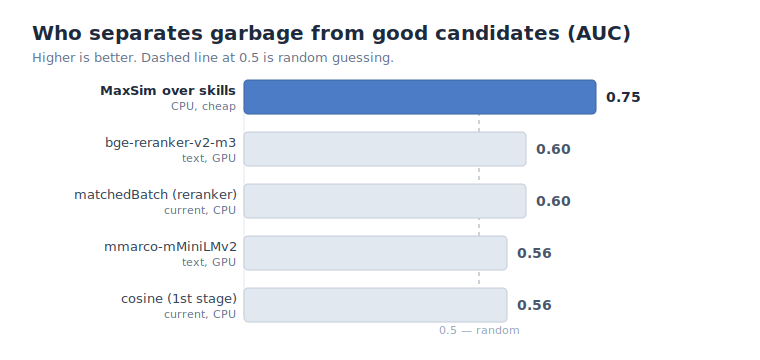

# A Cheap Skill-Overlap Score Beat GPU Rerankers: How We Filter Garbage Candidates Before the LLM

Anyone who has built candidate-to-vacancy matching on top of "vector search + an LLM judge" eventually has an awkward conversation with the invoice. The LLM stage is the most expensive part of the pipeline, and it turns out to spend a good half of its time on candidates a human would reject in a second. We decided to measure exactly how bad it was and to cut the garbage *before* the expensive stage — ideally without adding yet another heavy model. The story is instructive: the cheapest signal won, while the fancy GPU rerankers and fine-tuning lost.

## The problem: half of what reaches the LLM is garbage

Our pipeline is classic: cosine vector search collects candidates, a reranker cuts some, the rest goes to the LLM, which returns a `matched` verdict from 0 to 1 and explains it. We dumped the state on a testing copy of the database and looked at the real numbers.

- **213,633 candidates** created in the database. Cosine pulls in an average of **391 candidates per vacancy** (max: 7,585).
- **76,188** candidates reach the LLM (the reranker cuts the rest).
- Of those that reach the LLM, **47.9%** get `matched < 0.70` — i.e., they are **garbage**. Nearly **36,000 wasted LLM runs** and just as many junk records in the database.

The obvious question: why doesn't the reranker cut this? Because the existing cheap scores barely tell garbage from good. We computed the AUC for each — the ability to separate a "good" candidate (`matched ≥ 0.70`) from "garbage":

- the stored cosine score — on the testing base it was actually a constant (degenerate), AUC 0.50;
- the reranker score (`matchedBatch`) — AUC only **0.60**.

That is why half of the garbage cruises straight to the LLM. We needed a signal that actually separates.

## How we measured

We framed the task like engineers, not "predict a score" but a **cheap filter before the LLM**. Two metrics:

1. **AUC** — how well a score separates good from garbage.
2. **A business metric: what percentage of garbage we cut while keeping 95% or 99% of good candidates.** Losing good candidates is costly, so good-recall is a hard constraint.

The data for this is rich and balanced: 76,188 candidates with an LLM verdict, roughly half good and half garbage. No fine-tuning is needed to start — as our CTO put it, "first take off-the-shelf models and measure which one separates best."

## The approaches we tried

We didn't guess — we ran a bake-off on the same sample:

- **Cheap skill scorers** over the embeddings of already-extracted skills: Jaccard, coverage, IDF-weighted overlap, and **MaxSim** — late interaction over skills (for each vacancy skill, the max similarity to the candidate's skills, then averaged).
- **Off-the-shelf GPU rerankers on the full text** (vacancy × résumé), no fine-tuning: `BAAI/bge-reranker-v2-m3` (multilingual, ~568M) and `cross-encoder/mmarco-mMiniLMv2-L12`.
- **Fine-tuning a CrossEncoder** on 38k labeled pairs with hard-negative mining.
- **Logistic regression** as a combo of all the cheap features.
- **Mandatory-requirement coverage** — a separate hypothesis we return to below.

## What worked and what didn't

The headline table. AUC — separate a good candidate from garbage (higher is better):

| Scorer | Runs on | AUC |
|---|---|---|
| cosine (current 1st stage) | CPU | 0.56 |
| `matchedBatch` (current reranker) | CPU | 0.60 |
| mmarco (text) | **GPU** | 0.56 |
| bge-reranker-v2-m3 (text) | **GPU** | 0.60 |
| **MaxSim over skills** | **CPU** | **0.75** |

The result is counterintuitive: **heavy text rerankers on GPU (0.56–0.60) lost to simple skill overlap (0.75), which runs on CPU for pennies.**

What else didn't work:

- **CrossEncoder fine-tuning didn't converge.** The loss flatlined and held-out quality actually degraded. The cause turned out to be the data, not the learning rate: we have positives (created offers) but no *labeled negatives* — "this candidate does not fit the vacancy." The mined negatives are topically close candidates, some of which are actually fine matches that simply weren't processed. The model got a contradictory signal. Key lesson: **a broken training run is not a valid negative result** — you cannot present it as "CrossEncoder loses."
- **The feature combo (logistic regression) didn't beat MaxSim** — on a fair held-out split by vacancy both landed at ~0.69, and the weights showed MaxSim dominates while the other features add almost nothing.

### Watch out: selection bias

A warning for anyone measuring something similar. On our first pass we computed the correlation on "verified" offers only — and cosine looked completely useless there. That's a **range-restriction artifact**: 82% of those offers had been *selected by cosine itself*, so they all already have high cosine. Within a cosine-selected set, cosine has no power left to re-rank. Measuring a retriever's quality on the very data it selected is a classic way to fool yourself. Only the full candidate set, including the ones that were cut, gave the right picture.

## Why text lost to skills

The reason is simple once you think about it. A text reranker is trained to answer "is this passage relevant to the query." But all our candidates are already *on topic* — vector search selected them, they all look "relevant" to the reranker, and it can't tell them apart. The LLM verdict is about something else: **does the candidate cover the vacancy's skills and requirements.** That is exactly what skill overlap captures directly.

We confirmed this with one more measurement: the overall LLM verdict is almost entirely determined by the fraction of covered **mandatory** requirements — the AUC between "mandatory-requirement coverage" and "good" was **0.998**. So the target is to predict requirement coverage, and the skill signal does it most cheaply. We even tested the CTO's hypothesis — take skills only from mandatory requirements (drop the optional ones from the filter). Sound in principle, but the numbers gave nothing: 0.682 vs 0.679 — a good candidate covers both mandatory and optional, so the restriction changes nothing.

## The final solution and what it gives

We shipped a **MaxSim gate before the database write**. The logic at the selection stage: compute the skill overlap between the vacancy and the candidate; if it is below a threshold, the candidate is simply **not created as an offer** and never goes to the LLM.

The threshold is a single environment variable (`0` disables it):

- **threshold 0.69**: cuts **~9% of garbage** while keeping **99% of good ones** — a safe start;
- **threshold 0.73**: cuts **~25% of garbage** at the cost of **5% of good ones** — more aggressive.

What it gives in practice:

- **fewer wasted LLM runs** — direct savings on the most expensive stage;
- **less garbage in the database** — candidates that would be rejected anyway are simply not created;
- **cheap and reversible** — runs on CPU, reuses already-computed skill embeddings, turns on and off via the threshold with no redeploy;
- **a tunable balance** between "how much garbage we cut" and "how many good ones we keep."

A bonus that surfaced along the way: since the LLM verdict *is* requirement coverage, for each mandatory requirement you can see **which skill is missing**. That turns into a product feature — highlight the gap right in the offer and tell the recruiter *what to ask about during screening*.

## Lessons

1. **A cheap domain signal often beats heavy models.** Before renting a GPU for a reranker or starting a fine-tune, measure the baseline from what you already have. For us, skill overlap on CPU beat a multilingual reranker with 568M parameters.
2. **Measure on an honest sample.** Range restriction quietly turns a useful signal into a useless one and vice versa. If a retriever selected the data, don't evaluate it on that data.
3. **A broken experiment is not a result.** A training run that didn't converge tells you about your setup, not the method. Before you write "it doesn't work," make sure the loss actually went down.

Sometimes the best improvement to matching isn't a smarter model — it's a more honest question to your data.
