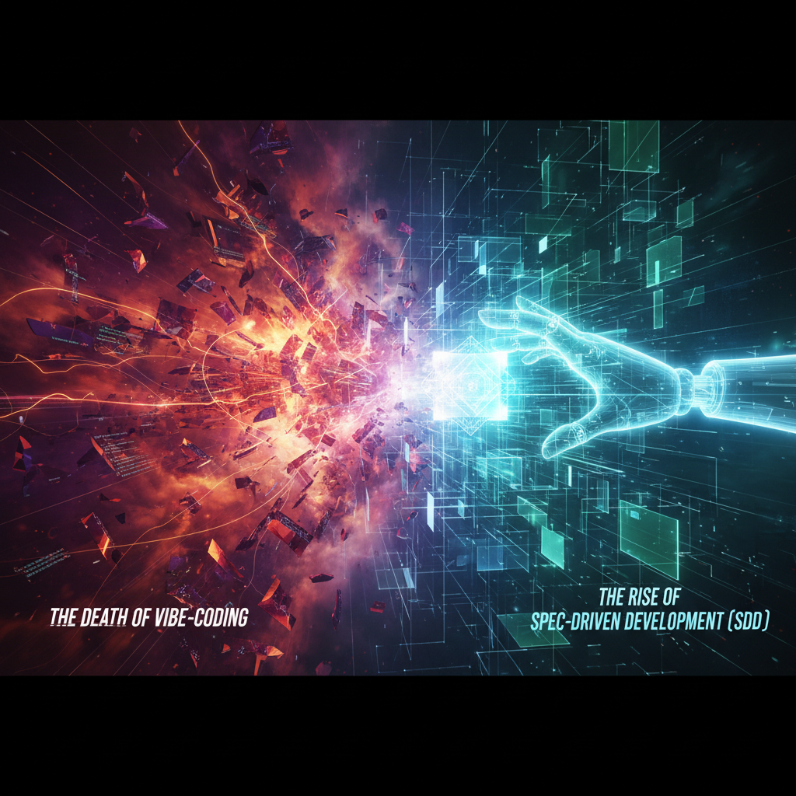

# The Era of 'Vibe Coding' is Dead: A Complete Guide to Spec-Driven Development (SDD) Frameworks

In 2026, writing code by simply throwing prompts into a chat ('vibe coding') has become as much of an anti-pattern as using goto in the 1970s. Endless cycles of edits, context rot, and AI agent hallucinations forced the industry to recall good old requirements engineering.

Thus, at the intersection of LLMs and classic design, **Spec-Driven Development (SDD)** was born - an approach where an AI agent is rigorously disciplined by a specification.

Today, there are at least 15 actively developing SDD tools on the market: from the **Superpowers** plugin with 166,000 stars on GitHub to the hardcore **MUSUBI** with just 28 stars. Popularity here does not equal quality - it merely reflects the level of process strictness.

In this article, we will break down the entire SDD ecosystem, categorize tools by three levels of Piskala's taxonomy of strictness, and understand what to implement in your project.

## ⚖️ Three Levels of Strictness: What Type is Your Contract?

Deepak Babu Piskala, in his 2026 work, classified SDD frameworks into three levels of strictness. This is the best mental model for tool selection:

✨ Level 1: Spec-First --> Preliminary Contract (write, generate, forget)

🔗 Level 2: Spec-Anchored --> Living Documentation (code and spec synchronization, traceability)

✍️ Level 3: Spec-as-Source --> Spec as Source Code (manual code editing FORBIDDEN)

### 🚀 Level 1: Spec-First (Letter of Intent)

The specification is written before the code, lives within the feature branch cycle, and becomes historical documentation after merging. The main advantage is **flexibility** and a low entry barrier. Most popular utilities reside here: *Spec-Kit, Superpowers, BMAD-METHOD, GSD, SpecSwarm, cc-sdd, Don Cheli SDD, Agent OS v3, Shotgun CLI, WordPress SDD, OWASP Skill*.

### ⚓ Level 2: Spec-Anchored (Design with Addendums)

The spec lives throughout the entire project lifecycle. Any change requires an update to the requirements, which cascades through design, code, and tests. The main advantage is **auditability and traceability**. Representatives: *MUSUBI, Intent (from Augment Code, $252M in investments), OpenSpec*.

### 🤖 Level 3: Spec-as-Source (CNC Model)

The specification is the only editable artifact. The developer does not touch the code at all. Files literally begin with commented caps: `// GENERATED FROM SPEC - DO NOT EDIT`. The advantage is **guaranteed correctness by definition**. In 2026, this is the forefront of commercial development: *Tessl (a project by Snyk founder Guy Podjarny, $125M in investments) and the academic CSDD methodology*.

## 📦 What Actually Lies Inside .specify/?

Many think that SDD frameworks are just a set of prompts. In reality, they are rigid artifacts. For example, when initializing the popular **Spec-Kit** (`specify init --ai claude`), an entire constitution is deployed to the repository:

text
.specify/memory/constitution.md
.specify/templates/spec-template.md
.specify/templates/plan-template.md
.specify/templates/tasks-template.md

`constitution.md` is the core of the system, containing 9 articles with criticality levels (MUST/SHOULD/MAY). Any code non-compliance with the constitution blocks a merge.

> **Article I - Library-First Principle:** Any feature must begin its existence as an independent library. It is forbidden to implement logic directly into the application code without extracting it into a reusable component.

The framework's pipeline will physically prevent the agent from running the `/implement` command until `spec.md`, `plan.md`, and `tasks.md` are created and validated. The agent cannot bypass these rules because they are hardcoded into the CLI, not just a prompt. As a result, the AI agent's working time on a task increases (on average from 8 to 33 minutes), but you get predictable architectural code instead of hacks.

## 🥊 A Deep Dive into Polar Approaches: Superpowers vs. MUSUBI

To understand the difference in strictness, let's compare the most popular tool with the most formalized one.

### ✨ Superpowers (166k Stars) - Iron Discipline for Claude Code

This plugin is loved for its one-command installation and absolute uncompromising nature. It doesn't have heavy configurations, but it does have a **HARD-GATE** in its prompts and TDD as a dogma.

Work is divided into 4 waves, each executed by a sub-agent in an isolated context (this solves the context rot problem):

🧠 **Brainstorming** (Socratic questions, selection of 2-3 approaches, mandatory user approval).

📝 **Plan** (step-by-step plan generation).

🛠️ **Implementation Prep** (test preparation).

🔄 **Dev Task** (Red-Green-Refactor cycle for each subtask).

Between the 1st and 2nd waves stands that very **HARD-GATE**. The plugin's instruction states:

> *"DO NOT invoke implementation skills, DO NOT write code, and DO NOT draft the project until the design is approved by the user."*

The second dogma is no changes to production code without a pre-written failing test. Sub-agents verify the actual output of the test runner, rather than taking the AI's word for it.

### 🏯 MUSUBI (28 Stars) - Regulator's Dream and 'Vibe Coders'' Nightmare

28 stars on GitHub is not a mistake, but an indication that this tool is only needed where bugs can land you in jail. **MUSUBI** implements Rolls-Royce aerospace industry standards.

Requirements are written strictly in the **EARS** (Easy Approach to Requirements Syntax) format, where words like *should, may, could* are forbidden, and only *SHALL* and *MUST* are used according to 5 patterns:

text
REQ-AUTH-001 [Ubiquitous]: The system SHALL hash all passwords using bcrypt (cost ≥ 12).
REQ-AUTH-002 [Event-Driven]: WHEN the user submits a form with valid credentials, the system SHALL return a JWT token.
REQ-AUTH-003 [Unwanted Behaviour]: IF login fails 5 times in 15 minutes, THEN the system SHALL block the account for half an hour.

Based on this, the `@traceability-auditor` sub-agent builds an automatic **Traceability Matrix**, which links the requirement ID to the design section, a specific line of code, and a line in the test file:

`REQ-AUTH-001 → design/auth.md § 2 → src/auth/service.ts:45 → tests/auth.test.ts:12`

If the matrix coverage drops below 100%, CI automatically blocks the PR. For legacy code, the `sdd-change-init` mode is provided, generating **delta-specifications** (diffs of business requirements). The overhead is enormous, but before a SOC2 or ISO audit, you will have a perfect development trail.

## ⚙️ Spec-as-Source: When Code is No Longer Written Manually

At the third level of strictness, where **Tessl** and the **CSDD** methodology rule, manual code editing is forbidden.

The Tessl framework works with a `.spec.md` file, marked up with inline annotations:

# Authorization Service
@generate src/auth/jwt-service.ts
@test src/auth/__tests__/jwt-service.test.ts

## Requirements
The system SHALL validate JWT tokens with every request. [REQ-AUTH-001]

You run `tessl build` - and the code is generated automatically. Need changes? You modify the human-readable spec, rather than diving into TypeScript or Go.

To prevent the AI from hallucinating with external libraries, Tessl uses a **Spec Registry** (a kind of `npm`, but for specifications). It already contains over 10,000 verified specifications of popular libraries. The architecture is built on a **Split Manifest System**: `tessl.json` manages versions for the machine, while `KNOWLEDGE.md` is fed to the LLM's context.

Meanwhile, the **CSDD** (Constitutional Spec-Driven Development) approach adds a *Security-by-Construction* layer. If the AI attempts to write an SQL query using simple string concatenation, a static analyzer (e.g., configured Semgrep) triggers constitution rule `SEC-001` (CWE-89) and strictly rejects the build, forcing the code to be rewritten using an ORM or parametrization. In banking microservices, this reduced vulnerabilities by 73% without losing feature development speed.

## 🎯 Choice Matrix: What to Apply in Your Project?

The choice of framework depends not on its coolness, but on your area of responsibility.

| Project Context | Recommended Stack | Key Feature | Startup Command |
|---|---|---|---|
| **Solo Developer, MVP, Startup** | **Spec-Kit** (lean preset) or **Superpowers** | Quick start, zero overhead, protection against dumb AI mistakes thanks to HARD-GATE. | `specify init --ai claude` |
| **Team > 10 People, Enterprise** | **MUSUBI** (large mode) + **Intent** | 100% audit trail, C4 architecture and ADR document generation. | `npx musubi-sdd@latest init` |
| **Brownfield, Heavy Legacy** | **OpenSpec** + **Shotgun CLI** | Delta-specifications. Shotgun first indexes the codebase and builds a dependency graph. | `uvx shotgun plan "My Feature"` |
| **Security-critical (Fintech, Medtech)** | **CSDD** + **MUSUBI** + **OWASP Skill** | 73% reduction in security defects. Protection against vulnerabilities at the generation stage. | CWE rules configuration in `constitution.md` |

## 🔮 Horizon 2026-2027: What to Implement Now

The SDD industry is rapidly standardizing thanks to two things:

🔌 **MCP (Model Context Protocol)** - an open protocol from Anthropic (transferred under the wing of the Linux Foundation). It's a kind of USB-C for AI agents. It replaces the zoo of formats (Markdown/TOML/YAML) with a standardized communication layer via JSON-RPC. Tools like Tessl already use MCP as a universal transport.

📄 **AGENTS.md** - a file in the project's root, describing the contract and behavior rules for any external AI agents (from OpenAI Codex to Cursor). Currently, over 60,000 open-source projects support it.

✅ **Verdict:** The skill of "spec engineering" is becoming key for architects. If you continue feeding "bare" prompts to AI, you will get bogged down in refactoring your own legacy.

👉 Start small: select one non-critical microservice and run it through **Spec-Kit** with the `lean` preset for two weeks. The results, in the form of clean architecture and absence of bugs, will surprise you.

---

## 📚 Read Also

- [AI-native Developer: A New Era of Product Development](ai-native-developer-new-era-product-development)
- [Your AI-Agent is Useless If It Doesn't Learn](ai-agent-self-evolution)
- [AI Experience: How to Stop Competing with Thousands of Candidates](ai-experience-job-market)
- [AI - It's Not About Prompts](ai-not-about-prompts)
- [AI: From Skills to Systems - Why Blueprints Change Everything](ai-skills-blueprints-systems)
