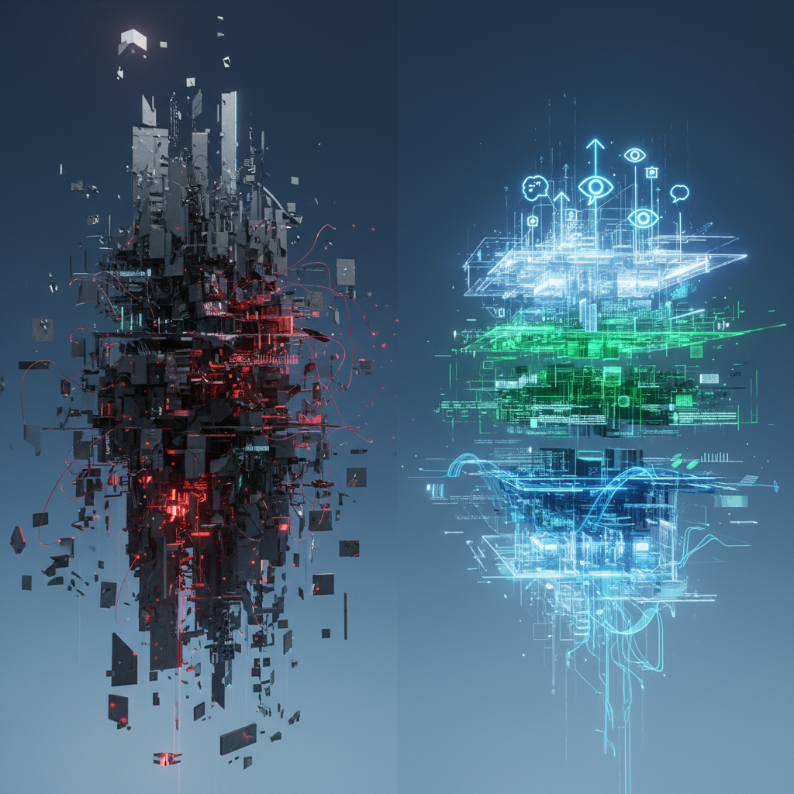

# The Evolution of AI SDLC: Why Vibe Coding and Spec-Driven Approaches Break at Scale and What's Next

Over the past year, the software development landscape has changed beyond recognition. We have imperceptibly moved from simple AI assistants in the "complete this line of code" style to autonomous multi-agent systems and advanced AI IDEs. The industry has split into two camps, each promising manifold productivity growth.

On one side, there's **vibe coding (Vibe Coding)**, where the developer simply communicates with the model in natural language, abstracting away from the code itself. On the other, there's **Spec-Driven Development (SDD)**, which attempts to tame the non-determinism of neural networks with strict textual contracts and instructions.

However, any technical leader who has attempted to deploy these approaches at the level of a large engineering team (say, 20-30 people or more) inevitably hits a dead end. Pull requests break commit conventions, specifications start to "hallucinate" and contradict each other, and the time saved on writing code is eaten up by hours of archaeology in Git history.

Why do both concepts fail at the enterprise level, and what should a mature SDLC look like in the age of AI? Let's find out.

## 🤯 The Illusion of Choice: The Systemic Flaw in Current Approaches

The main problem with both vibe coding and the Spec-Driven approach lies in the same architectural sin: **collapsing three fundamentally different layers of abstraction into one chaotic data array.**

When designing any system with AI, we operate on three levels:

1.  🎯 **Intent** - what the business or user wants, within what framework, with what success criteria and limitations (e.g.: *"The system must sustain 100k RPS and, if an item is out of stock, suggest a relevant replacement"*).

2.  📝 **Specification (Spec)** - a measurable, verifiable contract. These are strict pass/fail tests (evals). If a requirement cannot be turned into an automatic test, it is not a specification.

3.  🛠️ **Implementation** - specific architecture, patterns, and stack (microservices or monolith, caching, database structure).

Here's how modern methodologies handle these layers:

*   💬 **Vibe Coding:** No specification. Intent and implementation are mixed in the chat context window.

*   📑 **Spec-Driven:** One giant Markdown file where business requirements, tests, and architectural decisions are dumped together.

*   **Vibe Coding** completely ignores the contractual part. The model makes decisions "in the moment," without long-term memory or an audit trail. For a solo developer on a greenfield project, this is magic. For a distributed team, it's a logistical nightmare, leading to dozens of inconsistent and contradictory PRs.

*   **Spec-Driven Development** attempts to solve the problem of determinism by forcing humans to write detailed instruction sheets. But as soon as you change one high-level component (e.g., moving a deployment target from one cloud to another), the entire chain of downstream tasks in the specification collapses. Architectural decisions become hard-coded into the requirements document.

If, to fix a five-minute bug, your team has to update the specification, run it through an agent, spend millions of tokens validating edge cases, and then manually rewrite commit messages - your methodology is working against you.

## ✅ Solution: Separation of Concerns (Intent-Driven Development)

For AI SDLC to become a scalable engineering process, rather than shamanism, the three aforementioned layers must be isolated from each other. This concept forms the **Intent-Driven Development (IDD)** approach.

### Three-Level AI Development Schema

| Abstraction Layer | Who Manages | What It Contains |
|---|---|---|
| **Intent** | Human | Constraints, failure conditions, scalability requirements, and business logic. |
| **Specification (Spec)** | Human | A set of automatic evals and tests. A strict "pass/fail" contract. |
| **Implementation** | AI System | Selection of specific patterns, code writing, refactoring to fit the codebase. |

With this separation, a human stops being a "coder" or a "writer of detailed instructions for AI." The engineer's role shifts towards two key crafts: **Intent Crafting** (the ability to formalize business constraints into strict schemas) and **Spec Crafting** (designing verifiable test contracts).

The choice of implementation - monolith or microservice, in-memory cache or distributed - should remain with the AI system, which possesses the **empirical memory** of your specific organization (knowledge of context, legacy code, and accepted company practices). A human doesn't need to dictate architecture within a requirements file if the system is capable of inferring it from context and load constraints.

## 🚀 AI SDLC Maturity Matrix

Where is the software development automation industry heading? The entire stack can be divided into 5 levels of technological maturity:

### 1. 🕺 Vibe Level

*   **Tools:** Basic AI plugins for IDEs, chats.
*   **Substrate:** Model + current file context.
*   **Problem:** Lack of memory, standards, and contracts. Complete chaos at the team level.

### 2. 📝 Spec-Driven Level

*   **Tools:** Code generation systems based on static Markdown descriptions.
*   **Substrate:** Strict textual instructions interpreted by agents.
*   **Problem:** Extreme heavyweight nature. Specifications "drift" (spec diverges from actual code), documentation maintenance consumes all time savings.

### 3. ✨ Intent-Driven Level

*   **Tools:** Orchestrators of multi-agent systems with layer separation.
*   **Substrate:** Executable playbooks (scenarios) + corporate knowledge base (empirical memory).
*   **Status:** The current technological frontier for advanced teams. Roles are separated; the system itself proposes architectural solutions based on repository context.

### 4. 🤖 Autonomous Level

*   **Substrate:** A common semantic layer instead of individual scenarios.
*   **Feature:** The system is capable of self-reasoning and re-planning task chains (plays) on the fly when high-level intent changes.

### 5. 🏭 Fully Autonomous (Dark Factory)

*   **Concept:** A "dark factory" of software.
*   **Substrate:** A continuous cycle of compiling business intentions into a finished product. Humans are only at the input (goal validation) and output (acceptance of business value). As of today, largely a theoretical model.

## 📋 Checklist for a Technical Leader

If you are integrating AI agents into your development processes, ask yourself one diagnostic question:

> **Are we trying to pack intentions, tests, and architectural decisions into a single document and call it a "specification"?**

If the answer is "yes," you are on the verge of a methodological crisis. You will notice analysts drowning in writing texts for AI, developers quietly "vibing" past processes to meet deadlines, and agents beginning to ignore inflated instructions.

**What to do?**

1.  ✂️ **Detach architecture from requirements.** Describe target metrics (load, fault tolerance, security) in your intentions, but allow the system to adapt the code to these parameters itself.

2.  ✅ **Make the specification verifiable.** If a line in the requirements cannot be covered by an automatic eval, remove it or move it to the intent layer.

3.  🧠 **Invest in context, not prompts.** Models change every month. Prompts become obsolete. The only thing with long-term value is your project's empirical memory (structured knowledge base, architectural guidelines, and context history) to which agents connect.

Methodology becomes the main product of engineering management. Those who can build a clean, layered AI SDLC will gain those manifold multipliers in feature delivery speed. Others will continue to burn tokens, trying to make agents read outdated instructions.

---

## 📚 Read Also

- [Your AI Agent Is Useless If It Doesn't Learn](ai-agent-self-evolution)
- [AI: From Skills to Systems - Why Blueprints Change Everything](ai-skills-blueprints-systems)
- [Launching the Beta Version of an Intelligent Project Estimation Agent](launch-beta-smart-project-estimation-agent)
- [We Need a New SDLC. And It's Not About the AI Trend.](new-sdlc-agentic-development)
- [The Demise of the "Ordinary Senior": Why Your Resume No Longer Speaks to Productivity](the-demise-of-the-ordinary-senior-developer-ai-impact)
