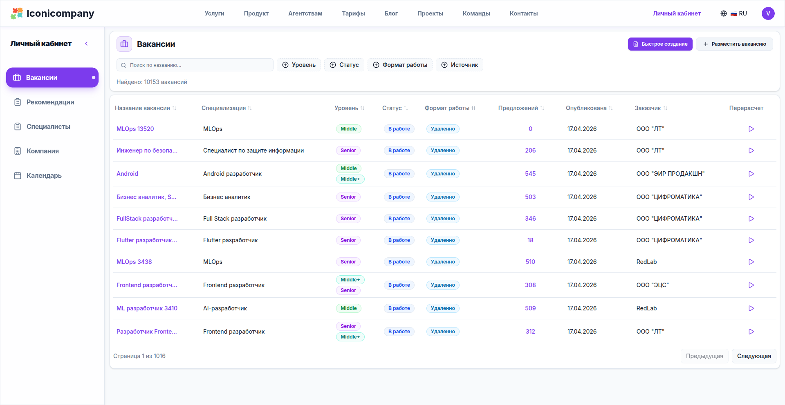
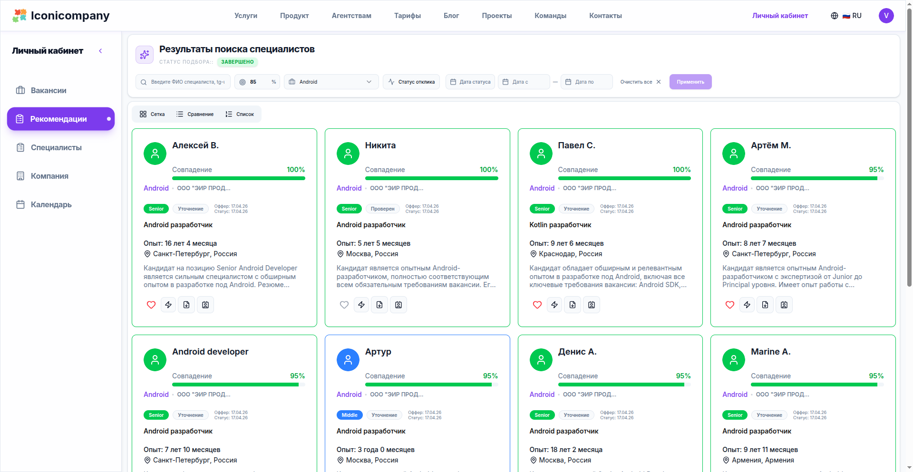
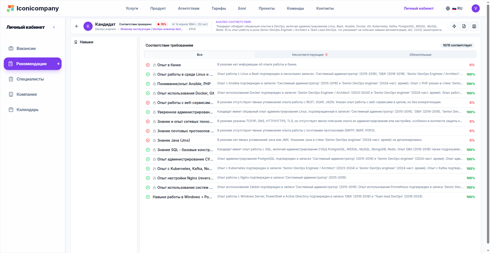
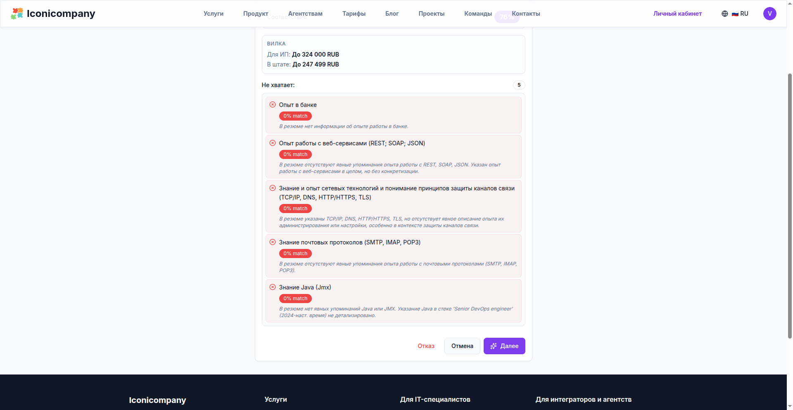

**Recruitment is broken.**
Not because there are no candidates.
But because the process is a chaotic set of actions without a system.

**Iconicompany** is an attempt to assemble hiring as an **engineering pipeline**, not an HR routine.

The platform processes **500+ vacancies per month** and covers the entire cycle:
from job signal → to a candidate who has already passed screening.

---

## 1. Jobs Appear Automatically

Instead of manual creation, the system automatically collects job openings from Telegram channels.
You can add them manually, but in reality, the flow is already there.

👉 This is important:
hiring begins not with candidate search, but with the **normalization of the incoming task stream**.

---

## 2. Candidates in 1 Minute (Not by Keywords)

One minute after publication - a list of candidates.

But the key is - **it's not keyword matching**.

The system understands the meaning:

> "data visualization" = "Tableau dashboards"

👉 This is no longer search.
This is **semantic matching in a vector space**.

---

## 3. 100% Match - Not Marketing, But a Model

Each candidate is assigned a **Match Score**.

This is not "similar/not similar," but a breakdown by skills, experience, and context.

👉 Important point:
we are not looking for "the ideal candidate"
we calculate the **probability of a fit**.

---

## 4. Comparison = Decision Making

If there are multiple candidates, comparison mode is activated.

Based on specific requirements.
Without a subjective "seems okay".

👉 And here's where the magic happens:

**like → automatic contact**

Without the recruiter as a bottleneck.

---

## 5. The System Clarifies Experience Itself

Resumes are always incomplete.
And almost always outdated.

The system generates questions:

- clarifies the tech stack
- checks for depth
- extracts hidden experience

---

## 6. Candidate Completes Their Own Profile

After a 'like', the candidate receives a link
and completes their profile:

👉 what they actually did

👉 what they worked with but didn't list

This removes 50% of the noise during the screening stage.

---

## 7. AI Voice Instead of Initial Interview

The final stage is voice screening.

AI checks:

- real knowledge
- depth of understanding
- adequacy of answers

Or immediately provides an interview slot.

---

# What This Changes

Recruitment ceases to be:

- manual
- slow
- subjective

And becomes:

→ a **pipeline with metrics**

→ a **decision-making system**

→ an **engineering task**

---

# Conclusion

**Iconicompany** is not "just another ATS".

It's an attempt to answer the question:

> what would hiring look like if it were originally built by engineers, not HR?

In short:

👉 job opening → 1 minute → candidates

👉 candidate → clarification → screening

👉 resulting in → an already vetted person

Without chaos. Without "let's have a call".

