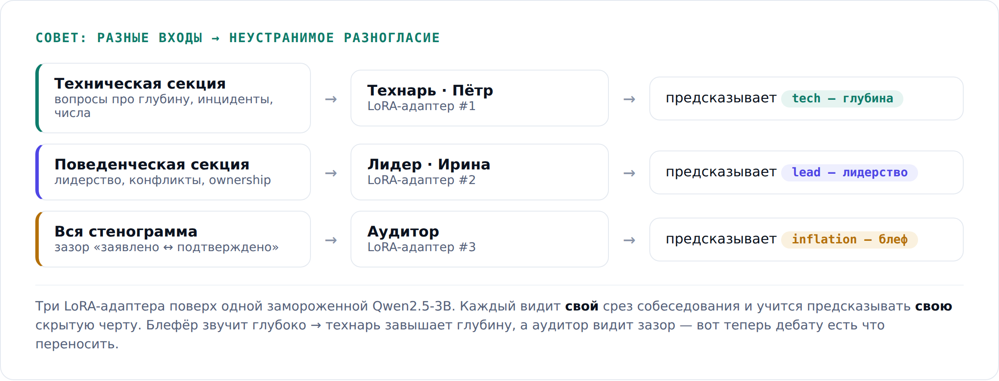
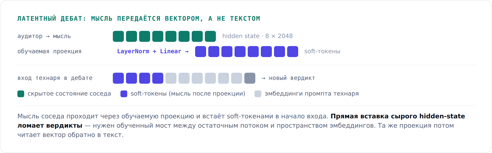
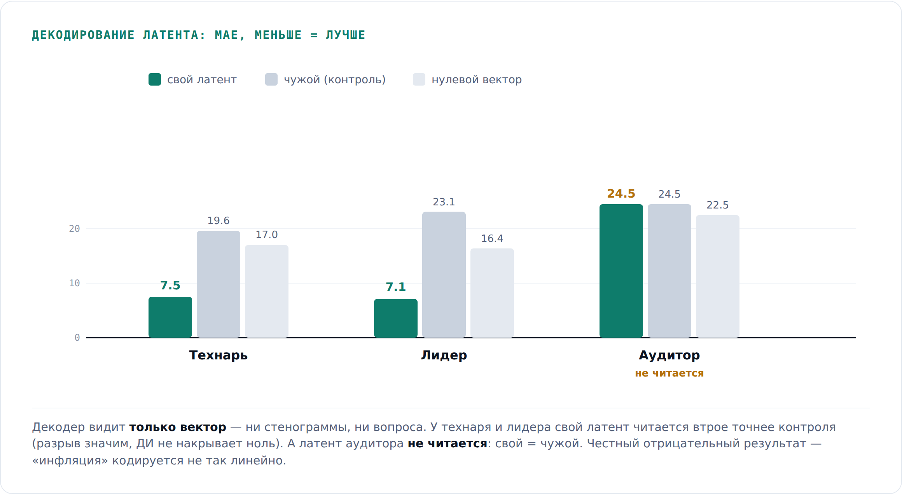
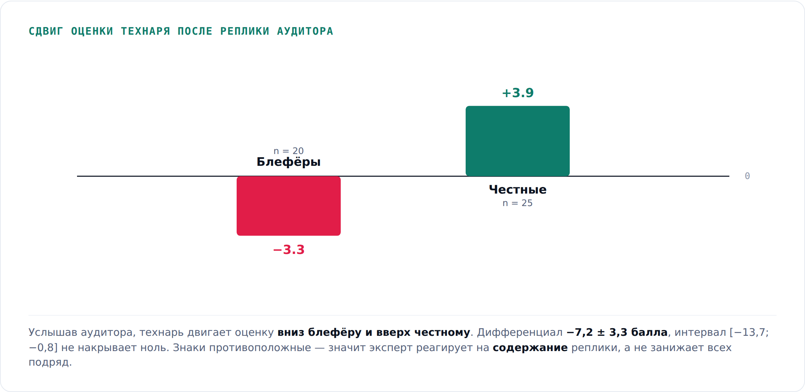

We build a council of several LoRA experts on top of a single frozen Qwen2.5-3B that assesses technical interviews. The experts exchange not text but **hidden states** — that is the "latent debate." This article is about how it works, what pitfalls we collected, and, most importantly, how we verified two things: **does this exchange carry real information** and **can the transmitted "thought" be decoded back into text**.

The honest bottom line up front: yes and yes, but with caveats. The tech and lead experts' latents decode; the auditor's latent **does not decode at all**. And the debate shifts scores in the right direction, but the gain on the final decision is still small — the bottleneck turned out not to be the debate.

### 🎯 Why argue in latent space at all

We do objective assessment of senior engineers. The core pain is **competency inflation**: a candidate confidently names technologies, but behind the words there isn't a single number or a single incident. One interviewer believes them, another doesn't. The assessment isn't reproducible.

The idea: not a single judge, but a **council of different roles** that argue. You could exchange via text — but that's slow (each expert generates a full response). So the exchange goes through **hidden states**: an expert passes a neighbor a vector from the model's residual stream, not words.

A note on novelty so there are no questions: exchanging latent states between agents has already been published — CIPHER (ICLR 2024), Interlat, a survey of eighteen methods. We don't claim it as ours. What's free is different: **none of these methods decode the transmitted message back into text**. Everyone's latent argument is a black box. Auditability of the channel is exactly what we tested.

> And yes, the "latent" is a hidden state (a residual-stream activation of dimension 2048), not the KV cache. Nobody passes the KV cache between agents.

### 🧩 The bench: data with known ground truth

The data is **synthetic**, and that's deliberate: we need objective ground truth to compare against, not "yet another LLM's opinion." The order is counterintuitive — truth first, dialogue second:

1. For each of 300 candidates we sample a hidden profile: continuous `tech`, `lead`, `inflation`.
2. An LLM generates a transcript **consistent with that profile**: high `tech` → specifics ("a table of 800M rows, 5k RPS, bloat"); high `inflation` → bluffing ("tens of thousands of RPS, near a terabyte" — scale claimed, no numbers).
3. The hire label is a deterministic rule over the profile: `veto if inflation ≥ 78, else 0.6·tech + 0.4·lead ≥ 62`.

The rule matches the label on 300 of 300 records. The expert learns to **recover the hidden trait from text**, and we honestly know the right answer.

### 🧠 Three experts that see DIFFERENT things

This is the main lesson. We train three LoRA adapters on top of one frozen 4-bit Qwen2.5-3B:

```python
model = FastLanguageModel.get_peft_model(
    model, r=16, lora_alpha=32, lora_dropout=0,
    target_modules=["q_proj","k_proj","v_proj","o_proj","gate_proj","up_proj","down_proj"])
```



We learned why different inputs are critical the hard way. Previous "councils" **couldn't argue by construction**: bootstrap clones of one model correlated 0.97–0.99 — essentially one expert in three copies. When experts are identical, there's nothing to argue about, and any trainable router over them freezes in place. Different inputs create irreducible disagreement: a bluffer sounds deep → the tech expert **overrates** their depth, while the auditor sees the gap between "claimed" and "confirmed."

### 🔀 Latent debate: a thought as a vector, not text

We take the expert's hidden state (shape `8 × 2048`), pass it through a trainable projection, and inject it into the neighbor's input as soft tokens:

```python
proj = nn.Sequential(nn.LayerNorm(H), nn.Linear(H, H))   # H = 2048
soft = proj(thought)                                     # hidden state -> soft tokens
e = torch.cat([emb(neighbor_prompt), soft, emb(tail)], dim=1)
```



### 🪤 The pitfalls we hit

**1. You can't drop a raw hidden state straight into embedding space.** The first (naive) implementation injected the last-layer hidden state directly into the input embeddings. Different spaces, different scales — the model fell apart and returned "hired" with invented reasoning for almost everyone. The fix is that trainable projection (LayerNorm + Linear).

**2. unsloth globally patches transformers.** On import it patches `Qwen2Attention`/`Qwen2DecoderLayer`, so the decoder has to be trained in a **separate process** on unmodified transformers — otherwise the backward pass breaks on inference's in-place kernels.

**3. The full run hung.** Generation via `inputs_embeds` without a reliable eos spun up to `max_new_tokens` — ~16 minutes per example. We killed it but saved the expensive parts (thoughts, verdicts, projection) and computed from cache afterward.

**4. `max_new_tokens` silently corrupted the sample.** A classic: we set a limit "to save time" — and all negative verdicts got truncated (they're longer). The "keep only parseable" filter dropped almost every "not hired" → a sample of only "hired" → **Brier = 0.0000 and F1 = 1.000 as a pure artifact**. We almost reported hitting the KPI. The safeguard:

```python
if share > 0.20:
    raise RuntimeError(f"{arm}: {share:.0%} unparseable at pass={lab} — the sample is being corrupted systematically")
```

### 🔍 Decoding: is the thought readable

We train a **decoder**: a trainable projection turns the expert's hidden state into soft tokens, and the **frozen** base recovers the verdict from them. The decoder sees **only the latent** — no transcript, no question.

And immediately — why a single number "the latent decodes at X%" isn't enough: the decoder could have just learned a typical answer. Only the **gap** between the own latent and a control matters. Hence three controls: another example's latent, a zero vector, and a constant prior.



By decision, agreement from the own latent is **89%** and **95%**, from another's — **57%** and **49%** (coin-flip level). The decoder reads exactly **that** thought. And the honest negative result we don't hide: **the auditor's latent does not decode** — most likely "inflation" is encoded in the hidden state less linearly than depth and leadership.

### ⚖️ Does the debate actually work — or is it noise

When the tech expert receives the auditor's thought, does it change its score because of the **content** of the message, or does it just add noise?



**The shift is directional.** The tech expert moves the score in opposite directions: down for bluffers, up for honest candidates. The differential is **−7.2 ± 3.3 points**, the interval [−13.7; −0.8] doesn't cover zero. Were it noise or blanket caution, the shift would be the same sign for everyone.

**It doesn't copy.** After the debate, the correlation of the tech expert's score with the auditor's opinion **drops** (0.31 → 0.17). If it were copying, it would rise. So it took the signal but arrived at its own number.

**The honest boundary.** The mechanism is proven, but the gain on the final decision is +0.006, not significant. Why? We measured it: the bottleneck isn't the debate, it's **expert accuracy**. The hire rule on true traits gives F1 = 1.000; on the experts' scores — 0.754. No amount of opinion-mixing saves a weak expert.

### 🧾 Honest limitations

- **It's synthetic.** There's no live human inside. We address the transfer risk with real interview transcripts, where the hidden "truth" is replaced by the real outcome — did the specialist pass probation.
- **The auditor's latent doesn't decode** — an open item.
- **The debate's gain on the decision is small** — and we know why (expert accuracy), rather than pretending everything is great.

But channel auditability is already valuable: for enterprise hiring, "show why the model decided this" is an entry requirement, not a nice-to-have.

### ♻️ Reproducibility

The whole cycle — independent verdicts, decoding the auditor's thought, and the debate — reproduces **on CPU, no GPU**: the Qwen2.5-3B base loads in bf16, forward takes a few seconds. The numbers in the article are recomputed from saved predictions by separate analyzers, not pulled from thin air.

---

We do objective engineer assessment inside the customer's closed perimeter. If this is your kind of thing, drop by our channel [@iconicompany](https://t.me/iconicompany) — we break down experiments like this and how they turn into a product.
