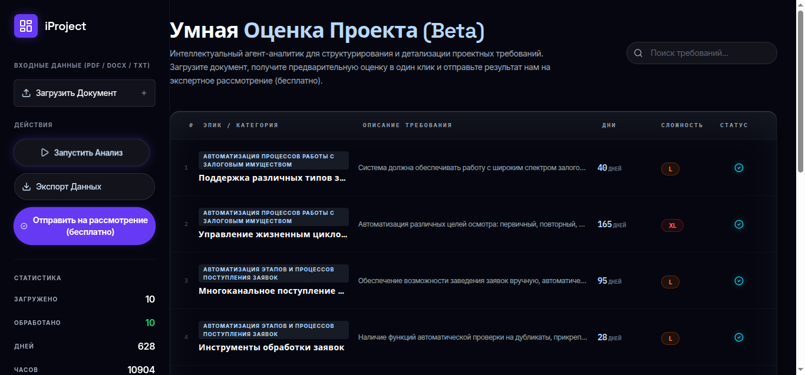

### Vibe Coding: From Idea to a Working Prototype in a Couple of Hours

Today, speed is more important than endless architectural discussions. We launched the beta version of [Smart Project Estimation](https://iproject.iconicompany.com/) — a tool that structures chaotic requirements and estimates project scope in just a couple of minutes.

The most interesting part here isn't just the functionality, but how it was built. This is pure **vibe coding**.

---

#### Tooling: Google AI Studio

The prototype was created in **Google AI Studio**. The core feature of this approach is that you "code" in a dialogue with a model that allows you to run and test the code immediately. There are other solutions like Lovable, but AI Studio was handy and did the job perfectly.

The process is as simple as it gets:
1. Generate logic in AI Studio.
2. Commit to GitHub.
3. Deploy to **Vercel**.

---

#### Architecture (or rather, the lack of it)

Let's be honest: the code structure here is "terrible."
- No **DI** (Dependency Injection).
- **SOLID** principles didn't even pass by.
- Maintaining such code in the long run would be a nightmare.

But for a prototype, it's an **ideal solution**. The entire frontend lives in one massive `App.tsx` file, and the backend is in `server.ts`. It's not about "perfect code"; it's about a "working solution." As a prototype, it completely fulfills its purpose.

> Building serious systems with RBAC, complex admin panels, and high reliability still requires deep engineering skills. But for testing a hypothesis, vibe coding is more than enough.

---

#### Technical Hurdles: PDF on Vercel

One issue we encountered: local PDF parsing worked perfectly, but on Vercel (in Serverless functions), it flat out refused to work. I had to "Google it" and adapt the imports.

Here’s an example of the backend handler (simple, straightforward, no extra abstractions):

```typescript
app.post('/api/extract-text', upload.single('file'), async (req, res) => {
  try {
    if (!req.file) throw new Error('File not received');
    const { originalname, buffer } = req.file;
    const extension = originalname.split('.').pop()?.toLowerCase();
    
    let text = '';
    if (extension === 'pdf') {
      const { PDFParse } = await import('pdf-parse');
      const parser = new PDFParse({ data: buffer });
      const result = await parser.getText();
      text = result.text;
      await parser.destroy();
    } else {
      text = buffer.toString('utf-8');
    }
    res.json({ text });
  } catch (error: any) {
    res.status(500).json({ error: error.message });
  }
});
```

And LLM requirement processing:

```typescript
app.post('/api/ai/detail', async (req, res) => {
  const { requirement } = req.body;
  const response = await ai.chat.completions.create({
    model: 'gpt-4o',
    messages: [
      { 
        role: "system", 
        content: 'Decompose requirements and return JSON: { "detailedDescription": "...", "estimate": "XS | S | M | L | XL" }' 
      }, 
      { role: "user", content: `Name: ${requirement.name}\nDescription: ${requirement.description}` }
    ],
    response_format: { type: 'json_object' }
  });
  res.json(JSON.parse(response.choices[0].message.content));
});
```

---

#### Conclusion

The biggest market shift right now isn't just the existence of AI. It's the fact that the speed gap between teams has become x5–x10. While some argue over which framework is "more correct," others use vibe coding to test a hypothesis and gather feedback.

We look forward to your feedback! If the project "takes off," we'll rewrite it according to SOLID. For now — enjoy, it works!

---

## 📚 Read More

- [Your AI Agent is Useless If It Doesn't Learn](ai-agent-self-evolution)
- [AI Experience: How to Stop Competing with Thousands of Candidates](ai-experience-job-market)
- [AI-native Product Engineer: A New Class, Not Just Another Developer](ai-native-product-engineer-new-class-not-just-another-developer)
- [AI Is Not About Prompts](ai-not-about-prompts)
- [Coding is the New Literacy. Why the Era of 'Just Developers' is Coming to an End](coding-new-literacy-era-of-just-developers-ends)
