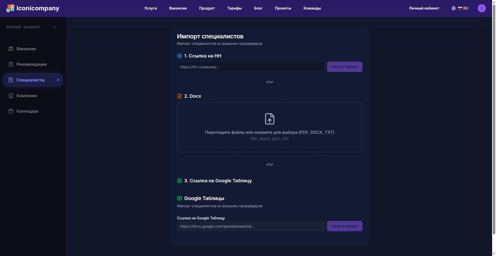

The Weakest Point in Outstaffing Isn't the Candidates.

It's the Bench.

---

For most agencies, it looks like this: 📝

Excel

Google Docs

Telegram chat

"a list somewhere"

---

And the moment a vacancy appears: ⏰

you start searching

recalling

rewriting

sending

---

While you're doing this -

the candidate has already been placed faster. 💨

---

We broke this cycle. 🚀

We added the ability to upload your bench directly into the system.

---

What this changes: 🤔

1. Your specialists are automatically matched with incoming vacancies (no manual selection required).

2. You get not a "search," but a stream of relevant matches.

3. Resumes can be immediately adapted for a specific vacancy (not just sent, but properly packaged).

4. Notifications arrive in Telegram → you react faster than the market.

---

The main thing: ✨

you stop "searching for candidates"

and start managing the flow of demand for your bench.

---

Difference in speed = difference in money. 💰

---

If you're interested, I can set up a pilot and show you how your bench starts working with the incoming flow of vacancies. 🤝

---

## 📚 Read also
