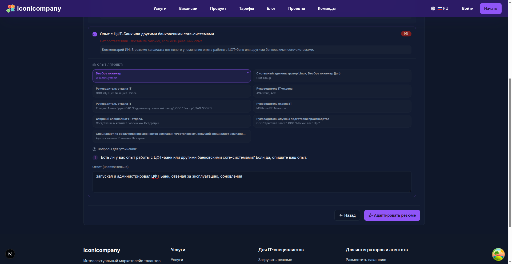

The modern IT job market is oversaturated with requirements. Even an experienced specialist's resume often remains "static," failing to reflect the specific skills that are critically important for a particular client right now.

As a result, recruiters spend hours on clarifying calls, and strong candidates get rejected simply because their profile lacked a coveted keyword.

## Problem: "Blind" Adaptation 🙈

Typically, the process looks like this: either the candidate manually rewrites their resume for each vacancy (which is long and tedious), or the recruiter tries to "sell" the candidate verbally.

❌ Lost time

❌ Distortion of facts

❌ Risk that AI or an ATS system won't recognize the relevant experience

## Solution: Interactive Screening via Link ✨

We have implemented a mechanism that allows precise clarification of a candidate's experience specifically on the points that are crucial for the vacancy.

### How it works:

1.  **Automatic Analysis** 🤖: The system compares the resume with the job description and identifies "white spots" - requirements not detailed in the profile.
2.  **Interactive Link** 🔗: The recruiter sends the candidate a link to the screening form.
3.  **Experience Clarification** ✍️: The candidate indicates which technologies they have actually worked with and adds short comments (e.g., "Yes, launched CFT-Bank in 2022").
4.  **Smart Adaptation** 🧠: Based on these answers, AI automatically rebuilds the resume, integrating new details into the relevant work experience blocks.

## Why is this needed? 🤔

### For Candidates:

✅ **Authenticity**: Your experience doesn't look "padded." Each clarification is linked to a specific workplace in your history.

✅ **Minimum Effort**: No need to rewrite the entire resume - simply answer specific questions.

### For Recruiters and Companies:

✅ **Speed**: You receive a resume perfectly tailored to your needs in minutes.

✅ **Transparency**: You see the candidate's verified experience across key tech stacks relevant to you.

## Conclusion 🚀

We believe that the hiring process should be transparent and fast. This new update shortens the path from initial contact to offer, making the resume a dynamic and relevant tool.

Try the new screening links today in your personal account!

---

## 📚 Read Also

- [AI Experience: How to Stop Competing with Thousands of Candidates](ai-experience-job-market)
- [The Ideal Resume: AI Pipeline and the Balance of Responsibilities vs. Achievements](ai-resume-pipeline-balance)
- [How We Redefined Developer Evaluation: From Resumes to Voice AI Interviews](developer-evaluation-voice-screening)
- [Developer, Tired of Getting Rejections on HH?](developer-project-resume-ai-agent)
- [The Death of the Static Resume: Why the Future of Hiring Lies with a Network of Digital Twins](digital-twins-ai-net)
