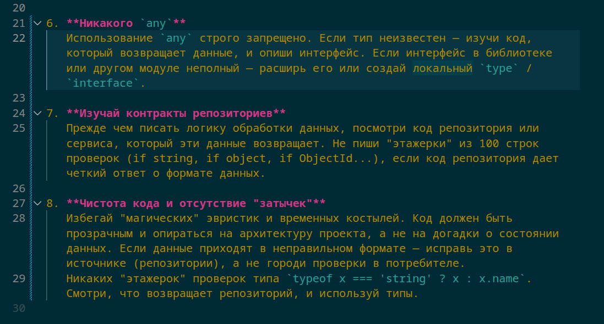

Большинство AI-систем в продакшене сегодня выглядят впечатляюще при первом запуске. Но спустя неделю они начинают вести себя как стажёр в бесконечном «первом дне»:

📝 **Дублируют ошибки**, которые вы уже исправляли руками.

🚫 **Игнорируют контекст** прошлых провалов.

🤯 **Не корректируют галлюцинации**, даже если им указали на конкретный файл с документацией.

В итоге вы не автоматизируете процессы, а просто платите за облачные вычисления, чтобы снова и снова делать код-ревью за нейронкой.

### 💥 В чем реальная проблема?

Мы часто путаем **модель** и **систему**. Ожидание, что «LLM сама разберется», разбивается о реальность эксплуатации, потому что:
1. ❌ **Отсутствует структура ошибок:** Мы не даем агенту классификатор его фейлов.
2. 🧠 **Нет фиксации опыта:** Ошибка в одной сессии никак не влияет на поведение в следующей.
3. 🔄 **Нет контура обучения (Feedback Loop):** Агент не обновляет свои системные промпты или базу знаний на лету.

> **Диагноз:** Это не агент. Это чат с очень короткой памятью и отсутствием инстинкта самосохранения.

### 🧠 Как выглядит здоровая система

ИИ-агент в продакшене должен эволюционировать как опытный инженер. Его жизненный цикл строится по принципу:
**Сделал ошибку → Отрефлексировал → Зафиксировал правило → Изменил поведение.**

#### Пример из жизни (Vibe Coding vs Production)

**Сегодня обычный агент:**
*   Неправильно обрабатывает контракт репозитория.
*   Начинает лепить `any` в TypeScript вместо использования явных типов.
*   Городит «этажерку» из `if/else` проверок там, где нужно было просто прочитать интерфейс источника.

**Что происходит завтра?**
В классической системе - всё то же самое. Вы снова тратите токены и время на те же правки.

**Что делает самообучающийся агент:**
Он анализирует ваш фидбек на код-ревью и фиксирует новые инварианты в свой `workflow.md` или базу знаний:
1. 🚫 *«Никогда не использовать `any` без глубокого анализа дерева типов».*
2. 🔍 *«Сначала проверять контракт репозитория в `/src/core/interfaces`, прежде чем предлагать реализацию».*
3. 📝 *«Не дублировать логику валидации, если она уже описана на уровне схемы БД».*

### 🧩 Важный сдвиг мышления: Агент - это процесс

Нужно принять факт: **AI-agent - это не статичная модель. Это самоэволюционирующая система.**

Если ваш агент не учится на своих действиях:

📈 Вы не масштабируете автоматизацию.

💸 Вы масштабируете **стоимость исправления ошибок**.

---

### 🚨 Главный вопрос к вашему стеку

Посмотрите на своего ИИ-помощника прямо сейчас.
1. 🤷‍♂️ Он просто «косячит» и ждет, пока вы поправите промпт?
2. 💡 Или он реально обновляет свои внутренние правила и становится умнее после каждого закрытого тикета?

**И вопрос «со звездочкой» для тех, кто строит серьезные системы:**
Удалось ли вам выстроить полный цикл от фичи до продакшена, где правила и обратная связь живут не в голове разработчика, а внутри рабочего процесса агента? Или ваш ИИ всё еще существует в вакууме «одноразовых» диалогов?

---

## 📚 Читайте также

- [AI-опыт: как перестать конкурировать с тысячами кандидатов](ai-experience-job-market)
- [AI - это не про промпты](ai-not-about-prompts)
- [Как мы "хакаем" HR-Tech: дискуссия с автором CALM из Tencent AI](hrtech-energy-score-pipeline-calm)
- [Собственная CMS на GitHub: как Copilot помогает писать, публиковать и анонсировать контент](copilot-cms-github-vibe-coding)
- [Как мы переосмыслили оценку разработчиков: от резюме к голосовому AI-интервью](developer-evaluation-voice-screening)
