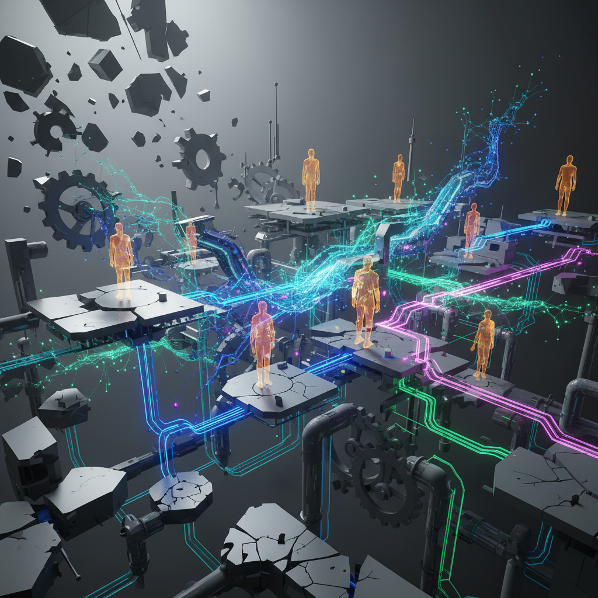

Многие до сих пор смотрят на происходящее как на «тренд AI». Но если присмотреться к движениям топовых игроков, становится ясно: история вообще про другое. Она про деньги и про то, что AI наконец-то столкнулся с реальностью.

### 💊 Конец эпохи «волшебных таблеток»
Сначала был чистый хайп: *«Модели всё решат, просто дайте нам контекстное окно побольше».*
Потом стадия платформ: *«Мы всё автоматизируем, просто подключите наш API».*
**А теперь рынок резко «переобулся». Стало понятно две вещи:**
1.  Модель сама ничего не внедрит.
2.  Платформа сама не изменит устоявшиеся (и часто кривые) бизнес-процессы.
Рынок пришел к модели: **«Давайте мы сделаем это за вас».**

### 💡 OpenAI и Anthropic - это новые Deloitte?
Посмотрите, что делают гиганты. Они не просто продают подписку на чат. Они приходят в корпорации, встраиваются в процессы, меняют архитектуру принятия решений и берут деньги за результат.
Звучит знакомо? Это не IT-революция в чистом виде. Это старый добрый **консалтинг**, внутри которого просто «зашиты» нейронки.
Они отправляют *forward-deployed* инженеров (привет, подход Palantir), чтобы те «починили систему» изнутри. Потому что технология без глубокой интеграции в конкретный бизнес - это просто дорогая игрушка.

### 🤝 Параллель, которую мы упускаем: Найм
Самое интересное, что этот же паттерн один-в-один повторяется в найме.
Компании годами думают: *«Нам нужно просто больше кандидатов»*. И начинают лихорадочно автоматизировать всё подряд:
*   🔍 Сорсинг (больше баз!);

*   📝 Скрининг резюме (больше ключевых слов!);

*   📊 ATS (больше дашбордов!).
**Но проблема не в технологии. Проблема в том, что вы не умеете «встраивать» человека в систему.**
Как и в случае с AI, вы покупаете «модель» (кандидата), но не меняете «процесс» (рабочую среду). В итоге:
*   Крутые специалисты теряются в воронке, потому что не прошли по формальному признаку.
*   Слабые проходят, потому что научились обходить фильтры.
*   Результат найма остается лотереей.

### 🧠 Почему внедрить AI проще, чем нанять профи?
Сейчас будет взрыв рынка «AI-интеграторов». Но они не решат главную проблему бизнеса.
> **Внедрить сложную нейросеть в инфраструктуру всё равно проще, чем изменить способ, которым люди принимают решения.**
>
В найме это видно лучше всего. Мы пытаемся лечить симптомы (мало откликов), вместо того чтобы лечить систему выбора и адаптации. Мы ищем «идеальную деталь» для сломанного механизма, вместо того чтобы починить сам механизм.
Пока вы не увидите, как конкретный человек будет работать именно в вашей системе (а не просто «какой у него стек»), найм будет оставаться бегом по граблям.

**P.S. 👇** Если вы чувствуете, что ваша система выбора кандидатов буксует - кидайте свою вакансию в комментарии (или в личку). Разберем по косточкам, где именно у вас ломается логика и почему к вам приходят не те.

---

## 📚 Читайте также

- [Ваш AI-agent бесполезен, если он не учится](ai-agent-self-evolution)
- [AI-опыт: как перестать конкурировать с тысячами кандидатов](ai-experience-job-market)
- [AI - это не про промпты](ai-not-about-prompts)
- [Идеальное резюме: AI-конвейер и баланс обязанностей vs достижений](ai-resume-pipeline-balance)
- [AI: От Skills к Системам - Почему Blueprints меняют все](ai-skills-blueprints-systems)
