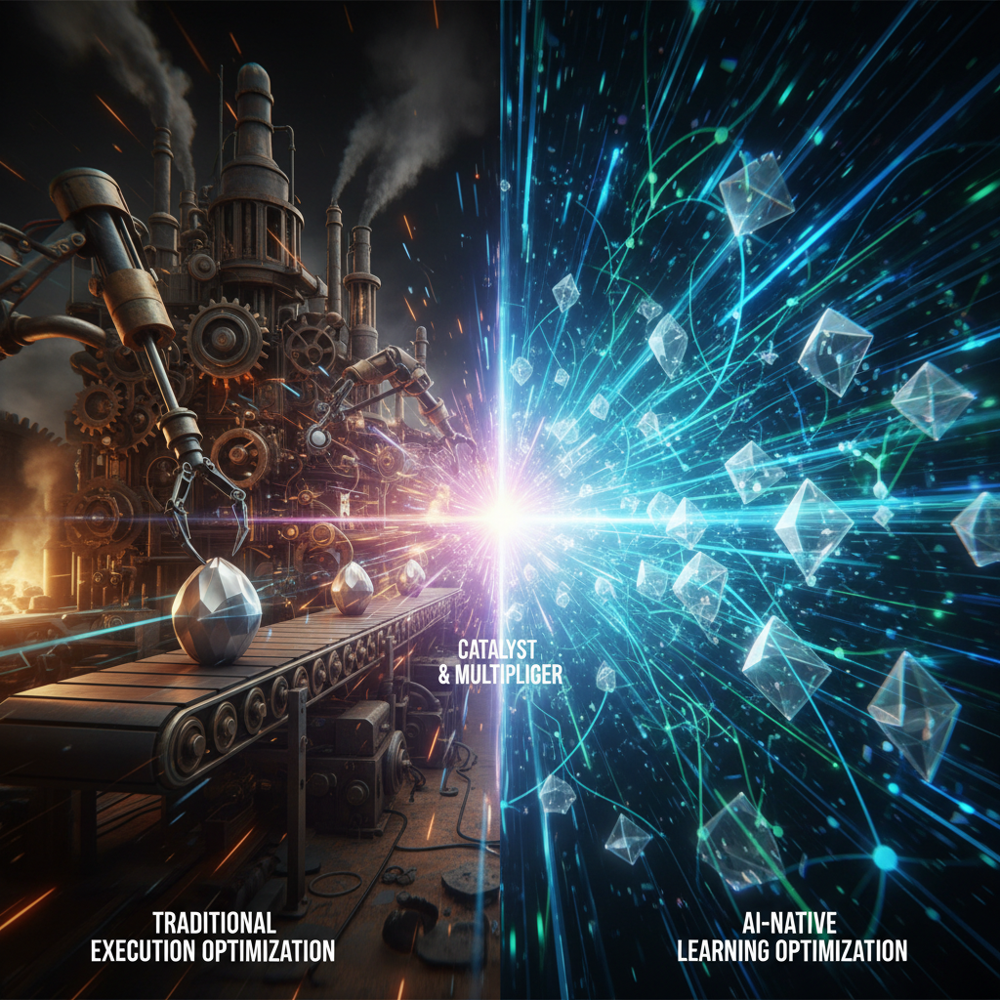

🚀 AI-native инженер продукта - это не "ещё один разработчик".
Это другой класс.

💡 Посмотрите, как работает классическая разработка:
Идея → обсуждение → согласование
→ Системный аналитик
→ Детализация
→ Архитекторы (иногда несколько)
→ Постановка задачи
→ Разработчик через несколько дней только начинает

Дальше:
Разработка
Тестирование
Релиз

И только потом вы понимаете:
👉 Это вообще была нужная фича или нет?

⌛ Проходит месяц.
💰 Съедается бюджет команды.

И вы купили... гипотезу.

❌ Проблема не в людях.
Проблема в модели.

Вы оптимизируете delivery,
но не оптимизируете проверку гипотез.

✨ Теперь другая сторона.

AI-native инженер продукта.

Он не ждёт:
- Аналитика
- Архитектора
- Идеального ТЗ

Он:
- Собирает прототип за день
- Проверяет гипотезу
- Смотрит на метрики

⚡ И делает это не раз в месяц.
А несколько раз в неделю.

📈 Разница не в "знает больше технологий".
Разница в поведении:
- Использует AI как multiplier
- Работает от гипотез
- Думает продуктом, а не задачами
- Доводит до результата

🚨 И вот здесь ломается найм.

Вы продолжаете искать:
- "5 лет опыта"
- "Знание стека"

Хотя реальная разница между людьми - x10.
И она вообще не в этом.

⏳ Пока одна команда тратит месяц на одну гипотезу,
другая - проверяет 10.

🏆 И выигрывает не тот, у кого "сильнее разработчики",
А тот, кто быстрее понимает, что не работает.

Кратко:
> 💡 Классическая разработка = оптимизация выполнения
> 🚀 AI-native = оптимизация обучения

💰 И это полностью меняет экономику продукта.

Если интересно - могу разобрать вашу вакансию и показать, ищете ли вы вообще тех людей.

---

## 📚 Читайте также

- [AI-native Разработчик: Новая Эра Продуктовой Разработки](ai-native-developer-new-era-product-development)
- [Самая дорогая ошибка в IT - это не архитектура. Почему найм - это судьба вашей системы](most-expensive-it-mistake-hiring-system-fate)
- [Как мы помогаем команде планировать спринты и находить узкие места в проекте](sprint-planning-quest-stop-method)
