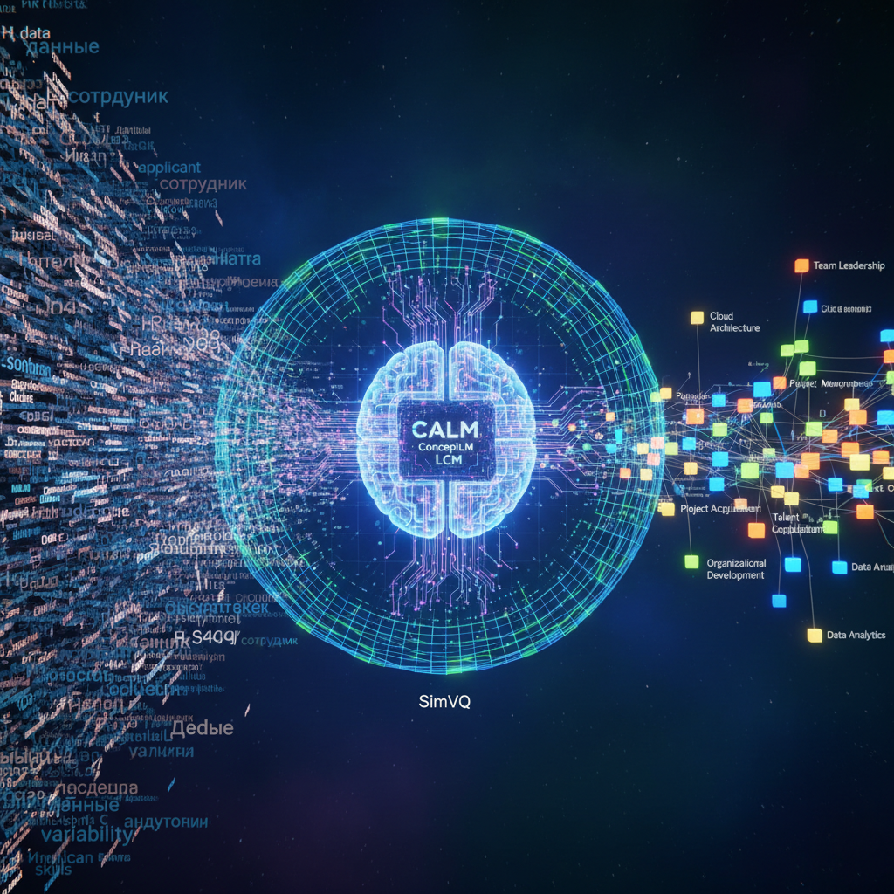

# Применение моделей SimVQ, CALM, ConceptLM и LCM в задачах извлечения и анализа профессиональных концептов в HR-домене 🧠

Каждый, кто хоть раз пытался построить качественный парсер резюме или систему матчинга «кандидат - вакансия», упирался в одну и ту же стену. Стену лексической вариативности.
Один разработчик пишет в профиле *«разработка высоконагруженных распределенных хранилищ»*, второй - *«sharding & replication, NoSQL optimization»*, а третий вообще обходится абстрактным *«улучшал архитектуру баз данных под терабайтные нагрузки»*. Для классических LLM, обученных предсказывать следующий токен (Next Token Prediction, NTP), это три абсолютно разные лингвистические структуры.
В этой статье мы разберем, как новые концепт-ориентированные архитектуры от FAIR, CALM, ConceptLM и геометрическая репараметризация SimVQ позволяют совершить сдвиг парадигмы: уйти от посимвольного разбора текста к прямому авторегрессионному моделированию в пространстве чистых смыслов и профессиональных концептов.

## Теоретические ограничения токенизации и переход к концепт-ориентированному моделированию

Ограниченность традиционных LLM обусловлена последовательным потокеновым декодированием. Потокеновая генерация создает бутылочное горлышко в вычислительной эффективности и семантической когерентности.
Для кодирования крупных смысловых единиц, таких как профессиональные навыки, опыт работы или академические траектории, размер словаря в рамках парадигмы NTP должен был бы расти экспоненциально, что делает расчет софтмакса (softmax) вычислительно невозможным. Данное ограничение особенно критично в HR-домене, где резюме соискателей и описания вакансий представляют собой слабоструктурированные тексты с высокой степенью лексической вариативности.

**Концепт-ориентированное моделирование (Concept-centric modeling)** решает эту проблему путем перехода от локальных токенов к абстрактным высокоуровневым семантическим единицам - концептам. Концепт является инвариантным относительно конкретного естественного языка или модальности представлением законченной мысли. Это позволяет сопоставлять синонимичные или близкие по значению формулировки непосредственно в многомерном векторном пространстве, игнорируя синтаксический шум и лексические несовпадения.
При обработке профилей кандидатов концептуальный подход позволяет абстрагироваться от конкретных слов и кодировать целостные профессиональные траектории соискателей. Это снижает длину обрабатываемых последовательностей в несколько раз, устраняя квадратичную вычислительную сложность self-attention механизмов при работе с длинными документами.

### Фундаментальные различия подходов в HR-задачах

| Параметр сравнения | Потокеновый подход (NTP) | Концепт-ориентированный подход (LCM / VQ) |
|---|---|---|
| **Базовая единица обработки** | Субсловесный токен (sub-word token) | Семантический концепт (фраза, предложение, навык) |
| **Зависимость от синтаксиса** | Высокая; чувствителен к порядку слов и опечаткам | Низкая; кодирует инвариантный смысл |
| **Мультиязычное выравнивание** | Требует отдельного перевода или кросс-языковой токенизации | Нативное; одинаковые смыслы проецируются в близкие векторы |
| **Вычислительная сложность** | Квадратичная относительно длины текста в токенах | Линейно-сниженная (K-кратное сжатие последовательности) |
| **Основной риск при обучении** | Переобучение на поверхностные статистические шаблоны | Коллапс репрезентации при квантовании пространства |

## Инновационные концептуальные языковые архитектуры ✨

За последние годы сформировалось несколько альтернативных подходов к отказу от токенов. Рассмотрим четыре наиболее перспективные архитектуры, которые меняют правила игры в анализе сложных текстовых структур.

### 1. Большие концептуальные модели (Large Concept Models, LCM)

Большие концептуальные модели, предложенные исследовательским подразделением FAIR, представляют собой архитектуру, полностью функционирующую в непрерывном векторном пространстве представлений предложений. Вместо предсказания отдельных слов LCM выполняет авторегрессионное прогнозирование последовательности векторов предложений.
Процесс обработки информации в LCM реализуется через трехэтапный конвейер:
Главным связующим звеном архитектуры выступает фиксированное семантическое пространство **SONAR** (Sentence-level Omnilingual and multimodal Representations). Эмбеддинги предложений в SONAR строятся на основе энкодер-декодерной модели, инициализированной весами LLaMA-3 и обученной на базе архитектуры NLLB с использованием split-softmax контрастивной функции потерь и синтетических жестких негативов (synthetic hard negatives).

> **Важно для HR:** Пространство SONAR поддерживает свыше 200 текстовых языков и 76 речевых модальностей, гарантируя, что семантически эквивалентные предложения на русском, английском или любом другом языке проецируются в соседние точки векторного пространства.

Ядро модели (LCM Core) оперирует исключительно с векторами SONAR. Разработчиками предложены три основные реализации ядра:

*   💫 **Base-LCM**: Трансформер-декодер, минимизирующий среднеквадратичную ошибку (MSE) между предсказанным вектором и истинным эмбеддингом следующего предложения.

*   💡 **Diffusion-based LCM (однобашенная и двухбашенная)**: Модели, использующие процесс диффузии для постепенного шумоподавления и генерации векторов концептов, что позволяет отразить нелинейную многовариантность развития мысли в тексте.

*   🔗 **Quantized LCM**: Модели, использующие дискретизацию непрерывных векторных представлений SONAR для последующей работы в конечном символьном пространстве «токенов-концептов».

**Ограничения LCM:** Они смещены в сторону работы с короткими предложениями разговорного характера, теряют мелкие синтаксические детали из-за отсутствия потокеновой верификации и могут деградировать в узкоспециализированных профессиональных доменах, если исходное пространство SONAR не улавливает специфическую терминологию.

### 2. Непрерывные авторегрессионные языковые модели (CALM)

Непрерывные авторегрессионные языковые модели (Continuous Autoregressive Language Models) предлагают альтернативный подход к преодолению дискретного барьера. Вместо использования внешнего фиксированного пространства предложений CALM обучат собственный высокоточный автоэнкодер для компрессии скользящего окна из K токенов в единый непрерывный вектор z_i.
Энкодер $f_{\text{enc}}: \mathcal{V}^K \to \mathbb{R}^l$ сжимает дискретные токены, а декодер $g_{\text{dec}}: \mathbb{R}^l \to \mathcal{V}^K$ восстанавливает их с точностью свыше 99.9%, используя избыточную информационную емкость вещественных чисел в векторе по сравнению с битовой емкостью дискретных индексов.
После компрессии модель осуществляет авторегрессионное прогнозирование в непрерывном пространстве над последовательностью векторов $Z = (z_1, z_2, \dots, z_L)$, где:
Обучение непрерывного генеративного ядра в CALM реализуется по **likelihood-free методологии**. Модель минимизирует энергетическую функцию потерь (Energy-Based Loss) посредством метода Монте-Карло, оптимизируя баланс между разнообразием генерации (предотвращением коллапса мод) и её точностью (fidelity).
Для калибровки непрерывной генерации и её корректного сравнения с классическими дискретными моделями авторы используют собственную метрику **BrierLM**, которая оценивает непрерывное распределение вероятностей без вычисления интеграла правдоподобия. При генерации полученный непрерывный вектор пропускается через декодер автоэнкодера, возвращая K дискретных токенов обратно в текстовое пространство.

### 3. Архитектура ConceptLM и парадигма Next Concept Prediction

Модель ConceptLM сочетает в себе сильные стороны дискретного и непрерывного подходов, внедряя метод **Next Concept Prediction (NCP)** поверх классической предобучающей задачи Next Token Prediction (NTP).
Платформа использует стандартный потокеновый энкодер для формирования промежуточных скрытых состояний $h \in \mathcal{H}$. Эти непрерывные состояния выполняют три роли:

1.  📍 Служат основой для классического NTP.

2.  📊 Агрегируются во времени для сжатия в скрытые концептуальные состояния.

3.  🚀 Проецируются в дискретное латентное пространство концептов $\mathcal{D}_c$ посредством векторного квантования.

В процессе обучения ConceptLM строит дискретный семантический словарь концептов (concept vocabulary). Модель генерирует вектор концепта, который затем используется в качестве направляющего семантического контекста для декодирования последующей группы токенов.
Парадигма NCP выступает в роли более сложной регуляризирующей задачи, заставляющей модель удерживать долгосрочную семантическую структуру текста. Экспериментальные запуски ConceptLM на масштабах от 70M до 1.5B параметров (с использованием архитектур Pythia и GPT-2), а также непрерывное дообучение на базе Llama-8B демонстрируют устойчивый прирост качества генерации по сравнению со стандартными NTP-моделями.

## Предотвращение коллапса репрезентации в векторном квантовании посредством SimVQ 🛡️

Дискретизация непрерывного пространства представлений с помощью векторного квантования (Vector Quantization, VQ) лежит в основе многих гибридных моделей, включая ConceptLM, квантованные варианты LCM и системы извлечения латентных концептов (VQLC). VQ сопоставляет непрерывный вектор z с ближайшим дискретным прототипом (кодовым словом) c_i из обучаемой кодовой книги (codebook) $C = \{c_1, c_2, \dots, c_K\}$.
Однако традиционное векторное квантование подвержено **коллапсу репрезентации (коллапсу кодовой книги)**. Поскольку при обучении методом straight-through estimation градиенты обновляют исключительно ближайшие кодовые векторы (дизъюнктивная оптимизация), большинство векторов в кодовой книге остаются невыбранными, превращаясь в неактивные («мертвые») коды. В результате кодовое пространство сжимается (token representation shrinkage), снижая разнообразие генерации и приводя к потере редких концептов.

> **Почему это критично для HR:** Если модель квантует навыки соискателей в дискретную библиотеку кодов, коллапс приведет к тому, что все разнообразные скрытые представления узкоспециализированных навыков (например, *«разработка смарт-контрактов на Solidity»* или *«программирование ПЛК»*) сольются с массовыми и часто встречающимися концептами (например, *«написание кода»* или *«управление проектами»*). Редкие, узконишевые и ценные навыки кандидатов станут просто невидимыми для алгоритмов подбора.

Метод **SimVQ** (SimpleVQ) элегантно решает проблему коллапса репрезентации с помощью геометрической репараметризации кодовой книги. Вместо оптимизации каждого кодового векторов по отдельности, SimVQ репараметризует векторы кодовой книги как линейную комбинацию обучаемого латентного базиса через один линейный слой:
где $\hat{C} \in \mathbb{R}^{K \times d}$ - матрица коэффициентов кодовой книги (размер кодовой книги K, размерность латентного пространства d), а $W \in \mathbb{R}^{d \times d}$ - обучаемая матрица весов, представляющая собой латентный базис непрерывного пространства.
Благодаря такому разделению, обновление параметров W при расчете градиентов масштабирует, растягивает и поворачивает всё латентное пространство кодовой книги целиком, подстраивая его под динамически меняющееся распределение признаков на выходе энкодера. Совместная оптимизация пространства гарантирует, что даже невыбранные на данном шаге («неактивные») векторы кодовой книги сохраняют градиентную связь и остаются в активной зоне распределения данных.

### Как SimVQ соотносится с альтернативами:  तुलना

*   ❌ **SoundStream / dac**: использует эвристику периодической замены неактивных кодов случайными векторами из текущего батча, что часто нарушает стабильность сходимости.

*   📈 **Residual Vector Quantization (RVQ) / MoVQ**: повышает детализацию за счет многоканального квантования, но существенно усложняет архитектуру и увеличивает вычислительные затраты.

*   📏 **Finite Scalar Quantization (FSQ)**: проецирует латентное пространство на фиксированную низкоразмерную сетку, что исключает коллапс, но жестко ограничивает емкость модели при больших размерах словаря.

SimVQ обеспечивает практически 100%-е использование кодовой книги при любом её объеме, сохраняя емкость модели и позволяя масштабировать концептуальный словарь до сотен тысяч активных элементов.

## Практические сценарии применения в HR-домене 💼

### Извлечение концептов и автоматический парсинг резюме 📑

Автоматический разбор резюме (resume parsing) предполагает извлечение структурированной информации из файлов различного формата (PDF, DOCX, DOC) и её нормализацию в формат JSON для хранения в базах данных ATS (Applicant Tracking Systems). Ключевой проблемой здесь является разнородность разметки и стилей изложения соискателей.
Традиционные подходы используют каскадные гибридные модели, объединяющие скрытые марковские модели (HMM) для сегментации блоков текста на разделы (контакты, образование, опыт работы, навыки) и последующие классификаторы на базе условных случайных полей (CRF) или рекуррентных сетей BiLSTM-CNN для выделения конкретных сущностей внутри блоков.
Внедрение концепт-ориентированных архитектур позволяет использовать глубокие контекстуальные эмбеддинги предложений S-BERT (Sentence-BERT) для оценки семантического сходства предложений соискателя с целевым профилем должности напрямую через косинусное расстояние, обходя лексический барьер и жесткие правила регулярных выражений.
Интеграция концептуальных моделей позволяет также извлекать **«скрытый» контекст**.

> **Пример:** При анализе опыта работы во фразе *«руководил командой из 10 инженеров, выстроил процессы поставки ПО с нуля»* модель LCM автоматически кодирует текст в концептуальные векторы, близкие к понятиям *«Agile/Scrum Management»*, *«CI/CD Pipelines Setup»* и *«Team Leadership»*, даже если соискатель не указал эти термины в явном виде в списке ключевых навыков.

### Обучение представлений профессиональных навыков (Skill Vectors) 🛠️

Профессиональный навык в современном HR-Tech может быть математически формализован как **вектор навыка (skill vector)** - непрерывное, дискретное или гибридное представление в совместном низкоразмерном пространстве вакансий и умений соискателей. Обучение таких векторов реализуется через интеграцию сигналов из трех связанных графов:

1.  📈 Граф карьерных переходов (job transition graph).

2.  🔗 Граф связей должностей и навыков (job-skill graph).

3.  👥 Граф совместной встречаемости навыков (skill co-occurrence graph).

Для оптимизации представлений применяется метод байесовского персонализированного ранжирования (BPR) над триплетами совместной встречаемости. Это позволяет вычислять семантическое соответствие навыков и должностей простым скалярным произведением их векторов.
Применение Goal-Oriented Skill Abstraction (GO-Skill) с квантованием на базе SimVQ позволяет автоматически формировать дискретную библиотеку навыков из сырых неразмеченных текстовых логов работы сотрудников, вычленяя стабильно повторяющиеся поведенческие и технические концепты из неоптимальных сессий выполнения рабочих задач.
Математическое сопоставление векторов навыков сотрудника $s_i \in \mathbb{R}^K$ и требований задачи $t_j \in \mathbb{R}^K$ может быть реализовано через обучаемую матрицу соответствия $M \in \mathbb{R}^{K \times K}$:

### Сравнительный анализ точности классификации навыков и вакансий 📊

Ниже приведена таблица сравнения точности различных классификаторов при решении задач сопоставления резюме и вакансий на основе данных бенчмарков.

| Архитектурный подход | Входные признаки (Feature Extraction) | Метод классификации / Поиска | Точность (Accuracy) | Особенности применения |
|---|---|---|---|---|
| **TF-IDF + Регулярные выражения** | Частотный вектор слов, ручные регулярные правила | Метод опорных векторов (SVM) | 81.0% | Требует постоянной ручной поддержки словарей навыков и синонимов. Быстро устаревает. |
| **GloVe Word Vectors** | Статические векторные представления слов | Вычисление косинусного сходства векторов | 79.2% | Игнорирует контекст употребления слов (страдает от многозначности терминов). |
| **S-BERT Embeddings** | Эмбеддинги предложений S-BERT | Косинусное сходство предложений | 88.5% | Полноценный семантический поиск, не зависящий от точных текстовых совпадений. |
| **Deep Contextual BERT** | Глубокие контекстуальные эмбеддинги BERT | Многослойный перцептрон (MLP) | 90.0% | Хорошо извлекает локальные сущности, но требует много вычислительных ресурсов. |
| **Deep Contextual BERT** | Глубокие контекстуальные эмбеддинги BERT | Долгая краткосрочная память (LSTM) | 92.0% | Эффективно улавливает последовательную структуру опыта работы и хронологию. |
| **Deep Contextual BERT** | Глубокие контекстуальные эмбеддинги BERT | Метод опорных векторов (SVM) | **94.0%** | Высокая точность классификации соответствия сложных профилей кандидатов. |

## Синергетическая архитектура извлечения русскоязычных HR-концептов 🇷🇺

Обработка русскоязычных резюме накладывает специфические ограничения на алгоритмы парсинга. Богатая морфология русского языка (склонения по шести падежам, родам, числам, виды глаголов) и свободный порядок слов снижают качество сопоставления при использовании англоязычных или базовых мультиязычных токенизаторов. Исторический показатель индекса Жаккара при извлечении сущностей из русскоязычного раздела «Образование», например, составлял всего 0.806.
Для преодоления морфологических барьеров без потери грамматического контекста применяется комбинация мультиязычного концептуального пространства SONAR и специализированного русскоязычного зондирования с использованием фреймворка **RuSentEval**.
RuSentEval осуществляет диагностическое тестирование (*probing*) предобученных трансформеров на предмет сохранения ключевых синтаксических и семантических свойств русского языка (длина предложений, синтаксическая глубина дерева зависимостей, падежные сдвиги, глагольное время, число подлежащих и дополнений). Это позволяет гарантировать, что векторное сжатие в концепт-моделях сохраняет критически важные морфологические сигналы.
Ниже представлена разработанная сквозная архитектура автоматического извлечения русскоязычных HR-концептов из неструктурированных файлов резюме.

1.  📄 **Нормализация и OCR**

    Вход: Сырые файлы PDF, DOCX, DOC
    Удаление не-ASCII символов, исправление пробелов, нормализация скобок. Первичная подготовка данных для устранения шума конвертации.

2.  ✂️ **Сегментация на концепты**

    Вход: Очищенный текст резюме
    Применяется алгоритм сегментации предложений SaT (Split and Target). На выходе получаем набор логически завершенных фраз соискателя - разбиение документа на атомарные единицы смысла.

3.  ↔️ **Концептуальное кодирование**

    Вход: Фразы на русском языке
    Пропускаем фразы через фиксированный энкодер OmniSONAR-200. Получаем языково-независимые векторы предложений в $\mathbb{R}^{1024}$. Это стирает грамматические различия между русскоязычным резюме и англоязычным описанием вакансии.

4.  Compressing **Тематическое сжатие (CALM)**

    Вход: Последовательность непрерывных векторов
    Применяется обученный непрерывный автоэнкодер CALM с коэффициентом сжатия K=4. На выходе - непрерывный сжатый вектор траектории кандидата, обеспечивающий многократное ускорение семантического поиска.

5.  🗺️ **Дискретизация и маппинг навыков**

    Вход: Сжатые векторы профессионального опыта
    Квантование VQLC с использованием слоя SimVQ (с кодовой книгой). Проекция непрерывного опыта в дискретные индексы концептов из активной кодовой книги без риска коллапса редких кодов.

6.  ✨ **Генерация профиля соискателя**

    Вход: Дискретные индексы активных навыков
    Декодер ConceptLM, альтернативно оптимизированный по критерию Next Concept Prediction. Вывод итогового структурированного портрета кандидата в формате JSON-карточки под контролем концептуальной разметки.

### За счет чего архитектура выдает высокое качество? ✅

*   🌐 **OmniSONAR-200 (Этап 3)** стирает языковые барьеры. Если кандидат написал на русском *«разработка высоконагруженных распределенных хранилищ»*, OmniSONAR-200 спроецирует это предложение в область вектора *«development of highly loaded distributed storage systems»*, обеспечивая прямое сопоставление с зарубежными или мультиязычными вакансиями без этапа машинного перевода.

*   💪 **SimVQ (Этап 5)** выступает в роли главного стабилизатора классификации навыков. Обучаемая матрица весов $W \in \mathbb{R}^{d \times d}$ непрерывно корректирует ориентацию латентного пространства, предотвращая сваливание векторов специфических русскоязычных технологических стеков (или редких профессий) в общие, малоинформативные концепты вроде *«написание кода»*.

## Выводы и стратегические рекомендации 💡

Переход от потокенового анализа текстов к непрерывным и квантованным концептуальным архитектурам (LCM, CALM, ConceptLM, SimVQ) открывает новые возможности для автоматизации HR-процессов. Прямое сопоставление смысловых концептов в обход лексического анализа решает ключевые проблемы мультиязычного поиска, устойчивости к синтаксическому шуму и обработки длинных неструктурированных последовательностей.
Для внедрения данных решений в промышленную практику HR-Tech платформ рекомендуется придерживаться следующих направлений:

1.  ⚙️ **Использование гибридных конвейеров разбора данных**. Для высокоуровневого анализа больших баз резюме целесообразно внедрять непрерывные модели типа CALM или LCM, функционирующие на базе семантического пространства SONAR. Это позволяет мгновенно фильтровать миллионы кандидатов по глобальному смысловому соответствию вакансиям без промежуточных этапов перевода текстов.

2.  🛡️ **Внедрение SimVQ во все модули векторного квантования**. При построении внутренних корпоративных онтологий, словарей компетенций и навыков, а также при извлечении латентных концептов (VQLC), необходимо использовать SimVQ-репараметризацию кодовых книг. Это гарантирует 100%-е покрытие словаря навыков и предотвращает потерю редких профессиональных качеств из-за коллапса репрезентации.

3.  🔍 **Регулярное зондирование русскоязычных моделей**. Специфика морфологии русского языка требует обязательного внедрения специализированных инструментов оценки качества эмбеддингов, таких как RuSentEval. Это позволяет своевременно обнаруживать синтаксический и семантический дрейф в скрытых слоях трансформеров при их тонкой настройке на корпоративных данных.

---

## 📚 Читайте также

- [Ваш AI-agent бесполезен, если он не учится](ai-agent-self-evolution)
- [Как мы "хакаем" HR-Tech: дискуссия с автором CALM из Tencent AI](hrtech-energy-score-pipeline-calm)
- [AI-Driven Development: SDD (Spec-Driven) vs. Beads (Graph-Based Task Management)](ai-driven-development-sdd-vs-beads-graph-task-management)
- [AI-опыт: как перестать конкурировать с тысячами кандидатов](ai-experience-job-market)
- [AI - это не про промпты](ai-not-about-prompts)
