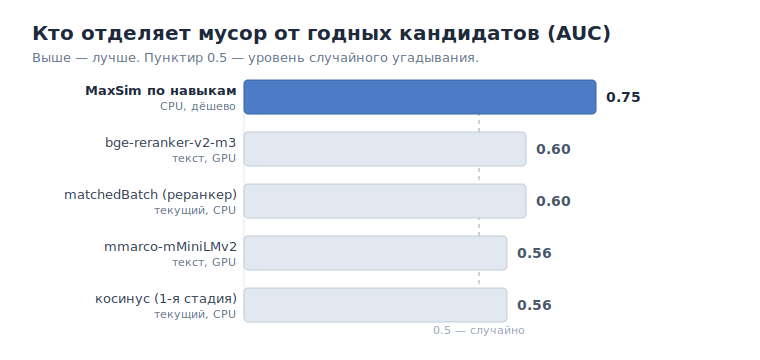

# Дешёвый скор по навыкам обошёл GPU-реранкеры: как мы отсекаем мусорных кандидатов до LLM

У любого, кто строил матчинг «кандидат — вакансия» на связке «векторный поиск + LLM-судья», рано или поздно случается неприятный разговор с финансовым отчётом. LLM-этап — самый дорогой в конвейере, и выясняется, что добрую половину времени он тратит на кандидатов, которых человек отбросил бы за секунду. Мы решили померить, насколько всё плохо, и найти способ отсечь мусор *до* дорогого этапа — желательно без ещё одной тяжёлой модели. История получилась поучительной: победил самый дешёвый сигнал, а красивые GPU-реранкеры и дообучение проиграли.

## Проблема: половина того, что доходит до LLM — это мусор

Наш конвейер устроен классически: сначала косинусный векторный поиск набирает кандидатов, часть отсекает реранкер, остальное уходит на LLM, который выносит вердикт `matched` от 0 до 1 и объясняет его. Мы выгрузили состояние на тестовой копии базы и посмотрели на реальные числа.

- **213 633 кандидата** создано в базе. Косинус нагоняет в среднем **391 кандидата на вакансию** (максимум — 7585).
- До LLM доходит **76 188** кандидатов (остальное отсекает реранкер).
- Из дошедших до LLM **47.9%** получают `matched < 0.70` — то есть это **мусор**. Почти **36 000 холостых LLM-прогонов** и столько же лишних записей в базе.

Логичный вопрос: а почему реранкер это не режет? Потому что существующие дешёвые скоры почти не отличают мусор от годных. Мы посчитали для каждого AUC — способность отделить «годного» (`matched ≥ 0.70`) от «мусора»:

- сохранённый косинус — на тестовой базе он вообще оказался константой (вырожден), AUC 0.50;
- скор реранкера (`matchedBatch`) — AUC всего **0.60**.

Вот почему половина мусора спокойно долетает до LLM. Нужен сигнал, который реально разделяет.

## Как мерили

Задачу мы сформулировали не как «предсказать оценку», а по-инженерному: **дешёвый фильтр перед LLM**. Метрики две:

1. **AUC** — насколько скор отделяет годных от мусора.
2. **Бизнес-метрика: сколько процентов мусора мы режем, сохраняя 95% или 99% годных кандидатов.** Терять хороших кандидатов дорого, поэтому рекол годных — жёсткое ограничение.

Данные для этого богатые и сбалансированные: 76 188 кандидатов с вердиктом LLM, примерно поровну годных и мусора. Дообучение для старта не требуется — как честно заметил наш CTO, «сначала возьми готовые модели и померь, кто лучше отделяет».

## Подходы, которые мы перебрали

Мы не стали угадывать, а прогнали бэйк-офф на одной и той же выборке:

- **Дешёвые скилл-скореры** на эмбеддингах уже извлечённых навыков: Jaccard, покрытие (coverage), IDF-взвешенное пересечение и **MaxSim** — late-interaction по навыкам (для каждого навыка вакансии — максимальная близость к навыкам кандидата, затем усреднение).
- **Готовые GPU-реранкеры на полном тексте** (вакансия × резюме), без дообучения: `BAAI/bge-reranker-v2-m3` (мультиязычный, ~568M) и `cross-encoder/mmarco-mMiniLMv2-L12`.
- **Дообучение CrossEncoder** на 38k размеченных пар с hard-negative mining.
- **Логистическая регрессия** как комбо всех дешёвых признаков.
- **Покрытие обязательных требований** — отдельная гипотеза, к ней вернёмся.

## Что сработало и что нет

Главная таблица. AUC — отделить годного от мусора (выше — лучше):

| Скорер | Где считается | AUC |
|---|---|---|
| косинус (текущая 1-я стадия) | CPU | 0.56 |
| `matchedBatch` (текущий реранкер) | CPU | 0.60 |
| mmarco (текст) | **GPU** | 0.56 |
| bge-reranker-v2-m3 (текст) | **GPU** | 0.60 |
| **MaxSim по навыкам** | **CPU** | **0.75** |

Результат контринтуитивный: **тяжёлые текстовые реранкеры на GPU (0.56–0.60) проиграли простому пересечению навыков (0.75), которое считается на CPU за копейки.**

Что ещё не сработало:

- **Дообучение CrossEncoder не сошлось — и это была наша ошибка.** Loss встал на месте, качество на held-out деградировало. Негативы у нас есть — целая база: почти половина кандидатов имеет `matched < 0.70`. Но обучали мы на «проверенной» подвыборке, где почти одни позитивы, и домайнивали негативы искусственно — вместо того чтобы взять реальные. Модель училась на противоречивом сигнале от намайненных «негативов», часть которых на самом деле нормальные матчи. Это не приговор методу, а кривая постановка с нашей стороны. Готовые реранкеры к тому моменту уже проиграли навыкам на полном размеченном наборе, поэтому честно обученный на реальных негативах CrossEncoder мы доводить не стали — это открытый вопрос. Урок вышел на нас самих: **сломанный прогон обучения — не валидный отрицательный результат**, тем более когда данные были, а мы взяли не ту выборку.
- **Комбо признаков (логрег) не побило MaxSim** — на честном held-out по вакансиям оба дали ~0.69, веса показали, что MaxSim доминирует, остальные признаки почти ничего не добавляют.

### Осторожно: артефакт отбора

Отдельно стоит предупреждение для тех, кто будет мерить похожее. На первой итерации мы считали корреляцию на «проверенных» офферах — и косинус выглядел там абсолютно бесполезным. Это **артефакт усечённой выборки (range restriction)**: 82% этих офферов были *отобраны самим косинусом*, то есть у всех косинус уже высокий. Внутри отобранного-по-косинусу множества у косинуса не остаётся мощности доранжировать. Мерить качество ретривера на данных, которые он же и отобрал, — классический способ обмануть себя. Правильную картину дал только полный набор кандидатов, включая тех, кого отсекли.

## Почему текст проиграл навыкам

Причина простая, если вдуматься. Текстовый реранкер обучен отвечать на вопрос «релевантен ли пассаж запросу». Но все наши кандидаты уже *по теме* — их отобрал векторный поиск, они все выглядят «релевантными» для реранкера, и он не может их разделить. А вердикт LLM — про другое: **закрывает ли кандидат навыки и требования вакансии**. Именно это и ловит пересечение навыков напрямую.

Мы это подтвердили ещё одним замером: общий вердикт LLM почти полностью определяется долей закрытых **обязательных** требований — AUC между «покрытие обязательных требований» и «годный» составил **0.998**. То есть цель — предсказать покрытие требований, а навыковый сигнал делает это дешевле всего. Мы даже проверили гипотезу CTO — брать навыки только из обязательных требований (убрать необязательные из фильтра). Идея правильная по смыслу, но на цифрах дала ноль: 0.682 против 0.679 — хороший кандидат закрывает и обязательные, и необязательные, так что ограничение ничего не меняет.

## Итоговое решение и что оно даёт

Мы выложили **гейт по MaxSim до записи в базу**. Логика на этапе отбора: посчитать пересечение навыков вакансии и кандидата; если оно ниже порога — кандидат просто **не создаётся как оффер** и не уходит в LLM.

Порог настраивается одной переменной окружения (`0` — выключено):

- **порог 0.69**: режем **~9% мусора**, сохраняя **99% годных** — безопасный старт;
- **порог 0.73**: режем **~25% мусора** ценой **5% годных** — агрессивнее.

Что это даёт на практике:

- **меньше холостых LLM-прогонов** — прямая экономия на самом дорогом этапе;
- **меньше мусора в базе** — кандидаты, которых всё равно отбросили бы, просто не создаются;
- **дёшево и обратимо** — считается на CPU, переиспользует уже посчитанные эмбеддинги навыков, включается и выключается порогом без передеплоя;
- **настраиваемый баланс** «сколько мусора режем / сколько годных бережём».

Отдельный бонус, который открылся по дороге: раз вердикт LLM — это покрытие требований, то по каждому обязательному требованию видно, **какого навыка не хватает**. Это превращается в продуктовую фичу — прямо в оффере подсвечивать пробел и подсказывать рекрутеру, *про что спросить на скрининге*.

## Уроки

1. **Дешёвый доменный сигнал часто бьёт тяжёлые модели.** Прежде чем арендовать GPU под реранкер или затевать дообучение — померьте baseline из того, что у вас уже есть. У нас пересечение навыков на CPU обошло мультиязычный реранкер на 568M параметров.
2. **Мерьте на честной выборке.** Range restriction тихо превращает полезный сигнал в бесполезный и наоборот. Если ретривер сам отобрал данные — оценивайте его не на них.
3. **Сломанный эксперимент — не результат.** Не сошедшееся обучение говорит о вашей постановке, а не о методе. Прежде чем писать «не работает», убедитесь, что loss вообще падал.

Иногда лучшее улучшение матчинга — это не более умная модель, а более честный вопрос к данным.
