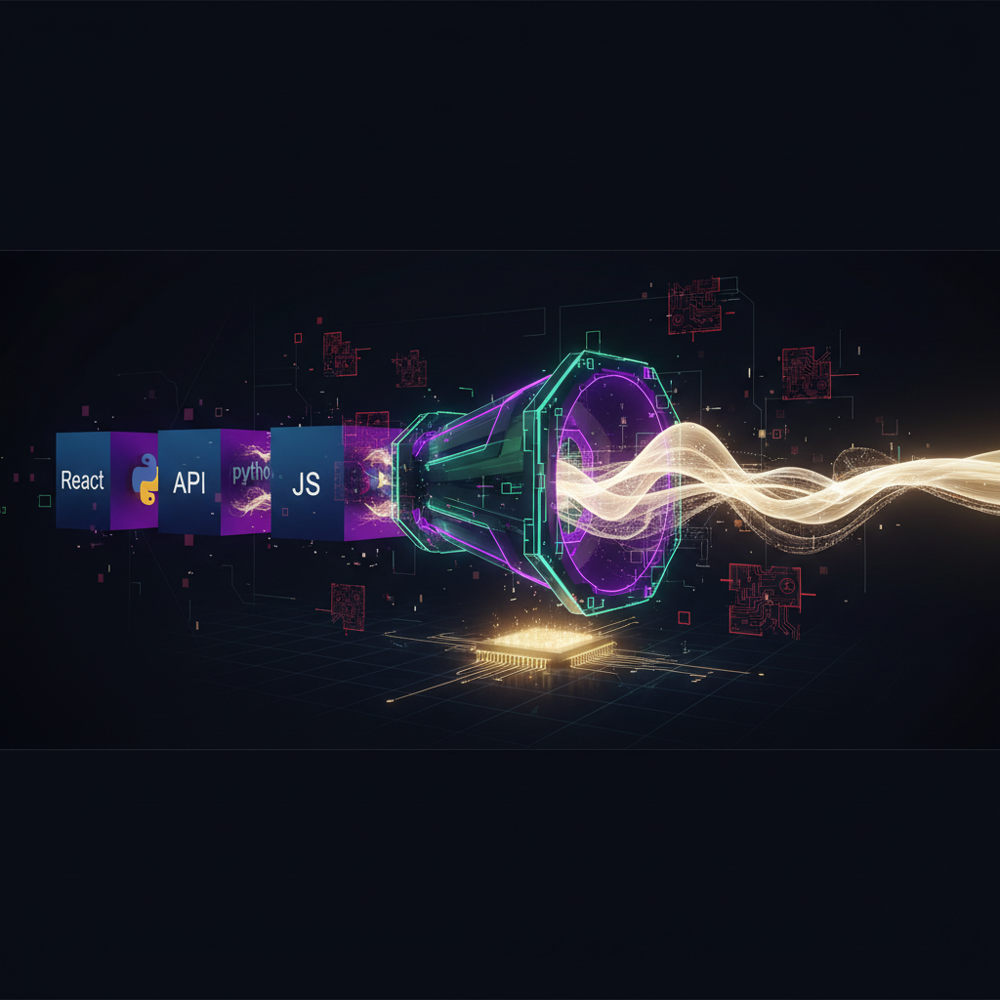

Взяли автоэнкодер из свежей работы **CALM (Continuous Autoregressive Language Models)**, который учится упаковывать чанк из K=4 токенов в один непрерывный вектор и разворачивать обратно, и обучили его не на 15 миллиардах токенов Pile на 8 GPU, как в оригинале, а на 18 тысячах коротких строк с требованиями из IT-вакансий - на обычной машине без видеокарты. По дороге выгребли три классических грабли (flash-attn без CUDA, deepspeed, который не импортируется под NumPy 2.x, и тихий OOM на 33 ГБ логитов). Ниже - подробный разбор архитектуры, конфигов и честные результаты round-trip-реконструкции.

---

## 💡 Зачем вообще что-то менять в языковых моделях

Современные LLM упираются в фундаментальное ограничение: они генерируют текст **по одному токену за шаг**. Сгенерировал токен → подал обратно на вход → сгенерировал следующий. Чем длиннее ответ, тем больше последовательных шагов авторегрессии, и это плохо параллелится по своей природе.

Авторы [CALM](https://arxiv.org/abs/2510.27688) ([GitHub](https://github.com/shaochenze/calm), [блог](https://shaochenze.github.io/blog/2025/CALM)) предлагают сместить парадигму: вместо предсказания одного дискретного токена модель предсказывает **один непрерывный вектор**, который кодирует сразу **чанк из K токенов**. Если K=4, то число шагов авторегрессии падает в 4 раза.

Появляется новая ось масштабирования - авторы называют её **semantic bandwidth (K)**: можно наращивать не только параметры и данные, но и объём информации, обрабатываемой за один шаг.

Чтобы это заработало, нужно две модели:

1.  **Автоэнкодер высокой точности** - учится сжимать K токенов в один вектор и реконструировать их почти без потерь. Это «словарь» между дискретным миром токенов и непрерывным латентным пространством.
2.  **Continuous-domain LM** - авторегрессионная модель, которая предсказывает следующий вектор в этом непрерывном пространстве (а не следующий токен).

Так как мы уходим из дискретного softmax-мира, обычный maximum likelihood больше не применим напрямую - поэтому в CALM есть целый likelihood-free тулкит: **Energy-based training**, метрика **BrierLM** и **temperature sampling** поверх чёрного ящика-сэмплера.

Эта статья - **про первую стадию, автоэнкодер**. Именно он определяет, насколько хорошо вообще возможна вся затея: если чанк токенов нельзя восстановить из вектора, то и моделировать в этом пространстве бессмысленно.

---

## 📚 Зоопарк моделей в репозитории

Чтобы было понятно, куда вписывается наш эксперимент, вот что лежит в репозитории CALM:

| Модель | Что делает | Параметры |
|:---|:---|:---|
| **Autoencoder** | сжатие K токенов ↔ вектор (стадия 1) | 75M |
| **CALM-M / L / XL** | непрерывная авторегрессия (стадия 2) | 371M / 735M / 1.82B |
| **AR baseline** | обычный токенный трансформер для сравнения | - |

Для стадии 2 предусмотрены три варианта **генеративной «головы»**, которая моделирует распределение следующего вектора:

-   **Energy-based** (`train_energy.py`) - основной, лучший по качеству;
-   **Diffusion** (`train_diffusion.py`);
-   **Flow Matching** (`train_flow.py`).

Качество в статье меряют метрикой **BrierLM**: CALM-M даёт 5.72, CALM-XL - 8.53, токенный baseline сопоставимого размера - 6.05. Энергетическая голова в их экспериментах обошла diffusion и flow.

Мы во всё это богатство не лезли - наш фокус строго на автоэнкодере.

---

## 🏗️ Архитектура автоэнкодера: разбираем по слоям

Это самое интересное. Автоэнкодер CALM - не «трансформер-энкодер», как можно подумать. Это **вариационный автоэнкодер (VAE), работающий внутри патча, целиком на MLP-слоях, без self-attention**. Разберём почему так и как именно.

### Базовый блок: AELayer (MLP, без внимания)

```python
class AELayer(nn.Module):
    def __init__(self, config):
        self.mlp = LlamaMLP(config)                 # SwiGLU как в LLaMA
        self.layernorm = LlamaRMSNorm(config.hidden_size, eps=config.rms_norm_eps)

    def forward(self, hidden_states):
        residual = hidden_states
        hidden_states = self.layernorm(hidden_states)
        hidden_states = self.mlp(hidden_states)
        return residual + hidden_states             # pre-norm + residual
```

Никакого attention. Это принципиально: автоэнкодер обрабатывает каждый патч из K токенов **независимо** от соседних. Его задача - локальное сжатие/распаковка чанка, а не моделирование длинных зависимостей. Контекст и последовательность - это уже работа авторегрессионной модели на стадии 2. Поэтому AE можно сделать дешёвым и быстрым.

### Энкодер: 4 токена → один вектор

Поток данных (для K=`patch_size`=4, `hidden_size`=512, `latent_size`=128):

1.  Вход `input_ids` решейпится в патчи: `(B, L) → (B·L/4, 4)`.
2.  Эмбеддинги: `(N, 4) → (N, 4, 512)`.
3.  **Стадия 0:** один `AELayer` поверх 4 токенов.
4.  **Squeeze:** конкатенируем 4 токена и сжимаем - `Linear(4·512 → 512)`. Вот тут и происходит компрессия патча: `(N, 4, 512) → (N, 1, 512)`.
5.  **Стадия 1:** ещё один `AELayer`.
6.  `hidden_to_latent`: `Linear(512 → 256)` → `(N, 1, 256)`.

Почему 256, а не 128? Потому что это **VAE**: 256 = `latent_size·2` - половина на `mean`, половина на `log_std`.

```python
mean, log_std = torch.chunk(latent_states, 2, dim=-1)   # по 128
std = torch.exp(log_std)
eps = torch.randn_like(mean)
latent_states = mean + eps * std                        # репараметризация
kl_loss = 0.5 * (mean**2 + std**2 - 1 - 2*log_std)
kl_loss = torch.clamp(kl_loss, min=config.kl_clamp).sum(-1).mean()
```

То есть латент - не просто вектор, а параметры гауссианы, из которой сэмплируется. KL-член с `kl_clamp=0.5` и весом `kl_weight=1e-3` регуляризует пространство, чтобы оно было гладким (важно для стадии 2, где по нему надо «ходить» авторегрессией).

### Декодер: вектор → 4 токена

Симметрично энкодеру:

1.  `latent_to_hidden`: `Linear(128 → 512)`.
2.  **Стадия 0:** один `AELayer`.
3.  **Expand:** `Linear(512 → 4·512)` и решейп обратно в 4 позиции - «разжимаем» патч.
4.  **Стадия 1:** ещё один `AELayer`.
5.  `lm_head`: проекция на словарь. Веса `lm_head` **связаны (tied)** с матрицей эмбеддингов энкодера - экономит параметры и стабилизирует обучение.

Лосс реконструкции - обычная кросс-энтропия по токенам, в режиме обучения домноженная на `patch_size` и сложенная с KL:

```python
loss = CrossEntropy(logits, labels)
if self.training:
    loss = loss * patch_size + kl_loss * kl_weight
```

### Гиперпараметры (дефолтный конфиг)

| Параметр | Значение |
|:---|:---|
| `patch_size` (K) | 4 |
| `hidden_size` | 512 |
| `intermediate_size` (MLP) | 1280 |
| `latent_size` | 128 |
| `num_encoder_layers` | 2 |
| `num_decoder_layers` | 2 |
| `ae_dropout` | 0.15 |
| `kl_weight` / `kl_clamp` | 1e-3 / 0.5 |
| токенайзер | Llama-3 (~128k словарь) |
| всего параметров | ~75.8M |

Любопытный факт: из 75.8M параметров **подавляющая часть - это таблица эмбеддингов** (~128k x 512 ≈ 65M). Сама «логика» энкодера-декодера весит единицы миллионов. Так что это очень лёгкая модель - что и делает её реалистичной для запуска без GPU.

---

## 🔬 Наш эксперимент: доменная адаптация на вакансиях

В оригинале автоэнкодер учат на ~15 млрд токенов датасета [pile-uncopyrighted](https://huggingface.co/datasets/monology/pile-uncopyrighted), на 8 GPU, в bf16, 30 000 шагов. Нам было интересно другое: **как поведёт себя эта архитектура на узком домене и на скромном железе?**

### Данные

`jobs_requirements.jsonl` - 18 065 коротких строк с требованиями из IT-вакансий, смесь русского и английского:

```json
{"text": "React JS 18+"}
{"text": "Понимание REST API"}
{"text": "Уверенное знание JavaScript: замыкания, асинхронное программирование (async/await | Promises), ES6+"}
```

Всего после токенизации и склейки получилось ~340k токенов. Это, конечно, на пять-шесть порядков меньше оригинала - так что это **proof-of-concept доменной адаптации, а не воспроизведение результатов статьи**. Договоримся об этом сразу, чтобы потом честно смотреть на цифры.

### Железо

Машина без видеокарты: **62 ГБ RAM, 28 ядер CPU, ни `nvidia-smi`, ни `nvcc`**, `torch.cuda.is_available() == False`. То есть условия максимально «бытовые».

### Конфигурация запуска

| Параметр | Оригинал (статья) | Наш запуск |
|:---|:---|:---|
| данные | ~15B токенов Pile | 18k строк вакансий (~340k токенов) |
| устройство | 8x GPU, bf16 | 1x CPU, fp32 |
| `block_size` | 2048 | **256** (см. грабли ниже) |
| `per_device_train_batch_size` | 8 | 32 |
| `learning_rate` | 3e-4 | 2e-4 |
| эпохи / шаги | 1 эпоха / 30 000 шагов | 5 эпох / 220 шагов |
| `latent_size`, `patch_size` | 128, 4 | 128, 4 |

---

## 🚧 Три грабли по дороге (то, ради чего читают Хабр)

### 1. flash-attn не собирается без CUDA

`requirements.txt` тянет `flash-attn==2.1.1`, который требует `nvcc` на сборку и GPU на запуск. На CPU-машине он не ставится в принципе. Лечение - поставить всё остальное, исключив его:

```bash
grep -v '^flash-attn' requirements.txt | uv pip install -r /dev/stdin
```

К счастью, сам автоэнкодер flash-attn не использует (его импортируют только головы energy/flow/diffusion/calm, и то - под `if is_flash_attn_2_available()`).

### 2. deepspeed не импортируется под NumPy 2.x

Обучение падало уже **внутри** `Trainer.train()` с такой трассой:


File ".../accelerate/utils/other.py", line 80, in extract_model_from_parallel
    from deepspeed import DeepSpeedEngine
...
File ".../deepspeed/autotuning/scheduler.py", line 8
    from numpy import BUFSIZE
ImportError: cannot import name 'BUFSIZE' from 'numpy'


`numpy.BUFSIZE` убрали в NumPy 2.0, а `deepspeed==0.10.0` на него завязан. При этом HF-`accelerate` импортирует deepspeed **только если он установлен** (`is_deepspeed_available()` = «пакет присутствует»). deepspeed нужен для распределённого обучения на GPU - у нас его нет и быть не может. Поэтому самое чистое решение - просто снести его:

```bash
uv pip uninstall deepspeed
```

(Откатывать NumPy вниз - рискованно: колёса pandas/pyarrow в окружении собраны под NumPy 2.x, можно поймать ABI-несовместимость.)

### 3. Тихий OOM на 33 ГБ логитов

Самое поучительное. С дефолтным `block_size=2048` процесс **молча умирал на нулевом шаге** - без трейсбэка, просто исчезал. Классическая подпись OOM-киллера (SIGKILL).

Причина - в форме тензора логитов. Декодер выдаёт логиты на **весь словарь для каждой позиции**:


logits: (batch x block_size x vocab) = 32 x 2048 x 128256 x 4 байта ≈ 33.6 ГБ


Плюс столько же на градиент в backward → ~67 ГБ на один шаг при 56 ГБ свободных. Отсюда мгновенный kill. В оригинале спасало то, что batch был 8 и обучение шло на GPU с большой памятью.

Лечение: логиты линейны по `batch x block_size`. Данные у нас короткие, поэтому длинный `block_size` не нужен. Снизили его до **256** (batch оставили 32):


32 x 256 x 128256 x 4 ≈ 4.2 ГБ   ← помещается с огромным запасом


RSS процесса после фикса держался на ~6.6 ГБ - стабильно.

---

## 🚀 Итоговый скрипт запуска

Все правки свели в воспроизводимый лаунчер (важно: запуск **модулем** `-m train.train_autoencoder` из корня репозитория, иначе не разрешается `import models`):

```bash
.venv/bin/python -m train.train_autoencoder \
    --train_file ./data/jobs_requirements.json \
    --validation_file ./data/jobs_requirements.json \
    --tokenizer_name ./llama3_tokenizer \
    --config_overrides "latent_size=128" \
    --block_size 256 \
    --output_dir ./checkpoints/autoencoder_requirements \
    --overwrite_output_dir \
    --per_device_train_batch_size 32 \
    --per_device_eval_batch_size 32 \
    --learning_rate 2e-4 \
    --num_train_epochs 5 \
    --do_train --do_eval \
    --save_safetensors False \
    --logging_steps 10 --report_to none
```

Мелочи, на которых тоже можно споткнуться:
- аргумент `--validation_file` не принимает расширение `.jsonl` (только csv/json/txt) - сделали симлинк `.json`;
- `--save_safetensors False` обязателен: у модели tied-веса (`lm_head` ≡ эмбеддинги), и safetensors отказывается сериализовать общие тензоры.

---

## 📊 Результаты

Обучение: **220 шагов, 5 эпох, 22 минуты на CPU.** Лосс падал монотонно (с ~47 на случайной инициализации до ~10.6 к пятой эпохе на тренировочной цели).

| Метрика | Значение |
|:---|:---|
| eval_loss | 2.20 |
| **eval perplexity** | **9.04** |
| train_runtime | 22 мин 20 с |
| примеров/с | 5.2 (train) / 14.3 (eval) |

> Почему train-loss (~10.6) выше eval-loss (2.20)? В режиме обучения модель домножает реконструкционный лосс на `patch_size`, добавляет KL, кастует эмбеддинги в bf16 и применяет `ae_dropout=0.15`; на eval всё это выключено и считается чистый fp32. Так что разрыв ожидаем, это не баг.

### Проверка «себя»: round-trip через энкодер и декодер

Главный тест для автоэнкодера - прогнать фразу `текст → encoder → латент → decoder → текст` и сравнить. Делаем это детерминированно: в `eval()`, беря **`mean` латента** напрямую (минуя VAE-сэмплирование), и готовим вход как при обучении (добавить EOS, дополнить pad до кратности K):

```python
ids = tok(text)["input_ids"] + [tok.eos_token_id]
while len(ids) % P: ids.append(pad_id)
x = torch.tensor(ids).view(1, -1).reshape(-1, P)   # патчи (L/4, 4)
latent = model.encoder(input_ids=x)
mean, _ = torch.chunk(latent, 2, dim=-1)           # берём mean
logits = model.decoder(latent_states=mean)
pred = logits.argmax(-1).reshape(-1)               # реконструированные токены
```

Что получилось:

| Вход | Выход | Точность по токенам |
|:---|:---|:---|
| `React JS 18+` | `React от 3+` | 75% |
| `Understanding of REST API` | `егра и REST API` | 75% |
| `Уверенное знание JavaScript: замыкания, асинхронное программирование (async/await | Promises), ES6+` | `Уверенное знание JavaScript:овыкания, асинхронное программирование ( CI/CD,тами), егра+` | 75% |

### Честный разбор

Реконструкция **узнаваемая, но шумная**: каркас и значимые куски сохраняются («React ... +», «REST API», «Уверенное знание JavaScript: ... асинхронное программирование ...»), но примерно каждый четвертый токен искажается. И это не случайность: ровно **75% на фразах совершенно разной длины** - сильный сигнал, что модель систематически теряет ~1 токен из каждого патча в 4. Учитывая, что латент в 128 чисел сжимает 4x512 = 2048-мерное представление патча, а обучение длилось всего 5 эпох на крошечном датасете - это похоже на **недообучение**, а не на потолок архитектуры. В статье «near-perfect reconstruction» достигается на 15 млрд токенов; мы дали модели в ~44 000 раз меньше данных.

---

## ⏭️ Что дальше

Очевидные рычаги, чтобы поднять точность реконструкции на этом же домене:

-   **больше эпох** (20-50 вместо 5) - данных мало, переобучение здесь скорее в плюс для AE-реконструкции;
-   **больше данных** того же домена;
-   если появится GPU - вернуть `block_size`/`batch` оригинала и bf16, обучение ускорится на порядки;
-   поэкспериментировать с `latent_size` (шире латент → точнее реконструкция, но «тяжелее» пространство для стадии 2) и с `kl_weight`.

### Выводы

1.  Автоэнкодер CALM - это **MLP-VAE на патчах без attention**, и это осмысленно: задача локального сжатия чанка не требует моделирования контекста.
2.  Архитектура **достаточно лёгкая, чтобы крутиться на CPU** - 75M параметров, из которых 87% это эмбеддинги.
3.  Главные практические препятствия оказались не в ML, а в инфраструктуре: несовместимость `deepspeed`/NumPy и OOM из-за полноразмерных логитов на словарь в 128k. Оба лечатся за минуту, если понять причину.
4.  На микроскопическом доменном датасете за 22 минуты на CPU получаем рабочий, но лоссовый автоэнкодер (perplexity 9.04, ~75% точность реконструкции) - отличная отправная точка, чтобы дальше крутить гиперпараметры.

Код эксперимента: лаунчер `train/run_autoencoder_requirements.sh` и скрипт проверки `roundtrip_autoencoder.py`. Форк [iconicompany/calm](https://github.com/iconicompany/calm), оригинал - [shaochenze/calm](https://github.com/shaochenze/calm), статья - [arXiv:2510.27688](https://arxiv.org/abs/2510.27688).


---

## 📚 Читайте также

- [Применение моделей SimVQ, CALM, ConceptLM и LCM в задачах извлечения и анализа профессиональных концептов в HR-домене 🧠](application-of-simvq-calm-conceptlm-lcm-in-hr-concept-extraction-analysis)
- [Как мы "хакаем" HR-Tech: дискуссия с автором CALM из Tencent AI](hrtech-energy-score-pipeline-calm)
- [Методы извлечения навыков из резюме и вакансий](skills-extraction-methods)
- [От косинусного сходства к "энергии" смыслов: как исследование Tencent CALM меняет правила игры в ИИ-подборе](tencent-calm-vector-matching-optimization)
- [Ваш AI-agent бесполезен, если он не учится](ai-agent-self-evolution)