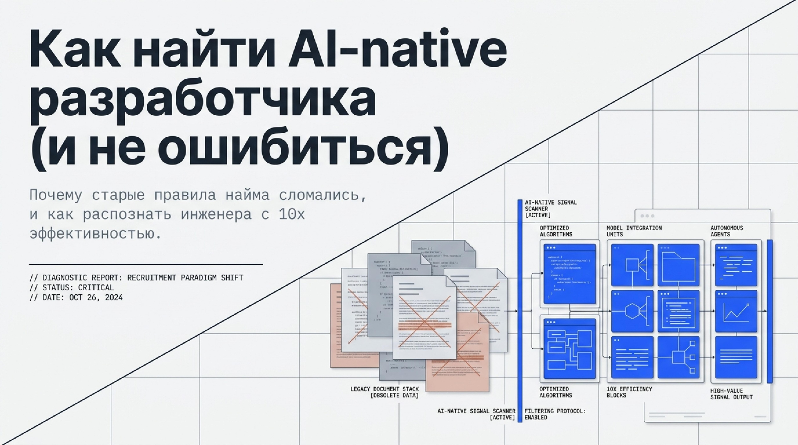

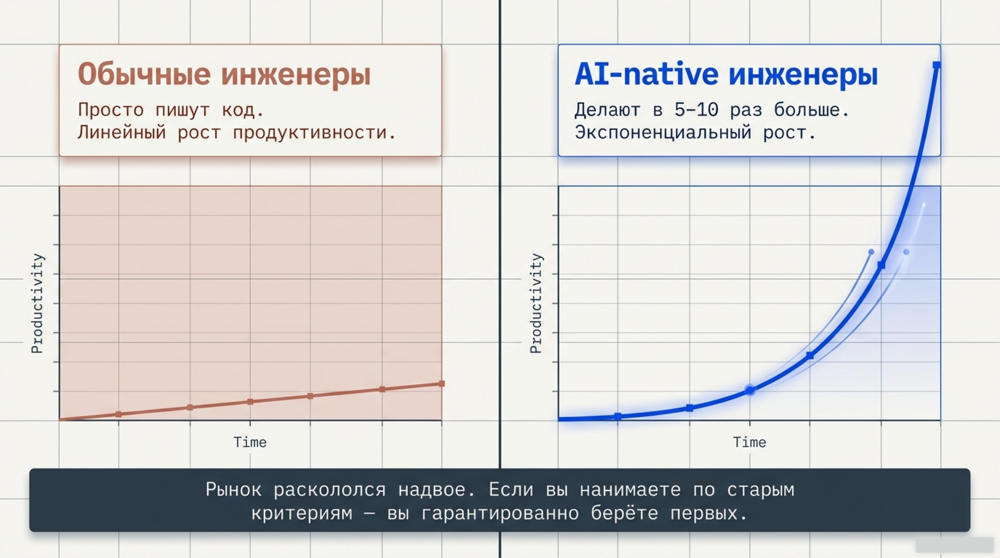

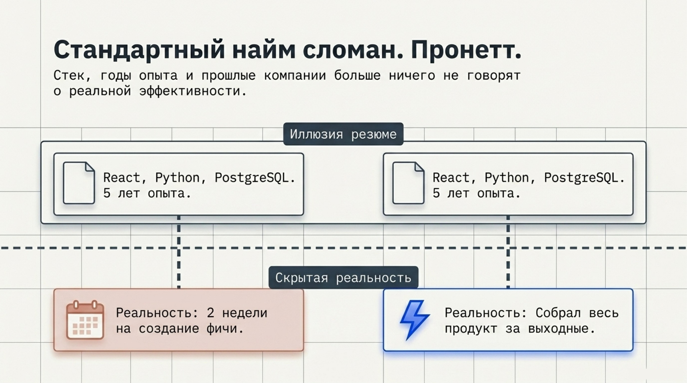

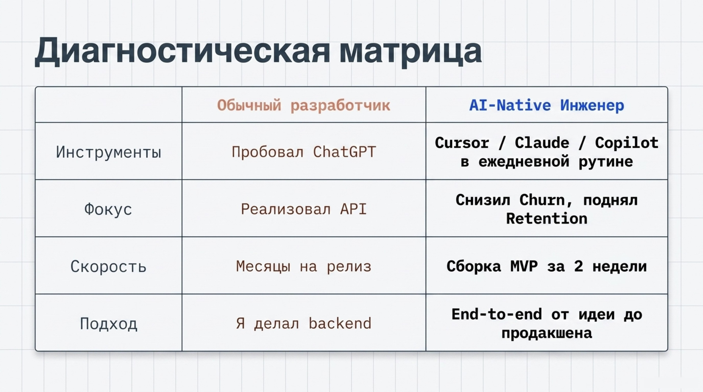

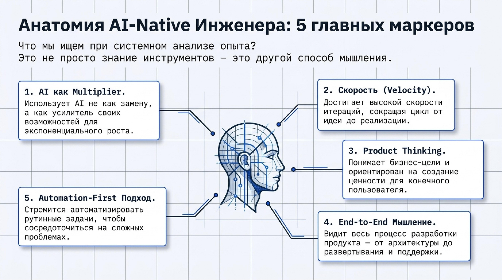

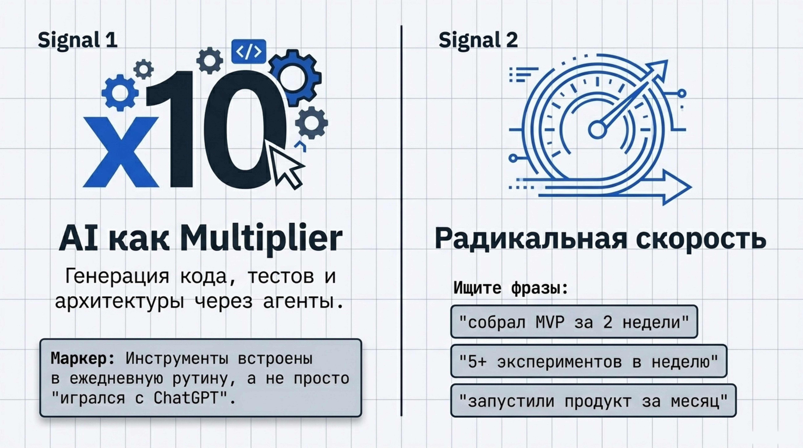

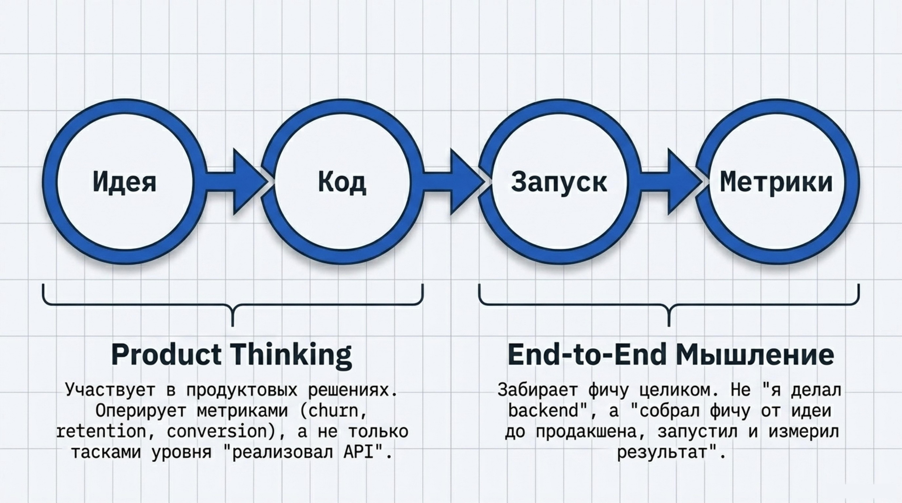

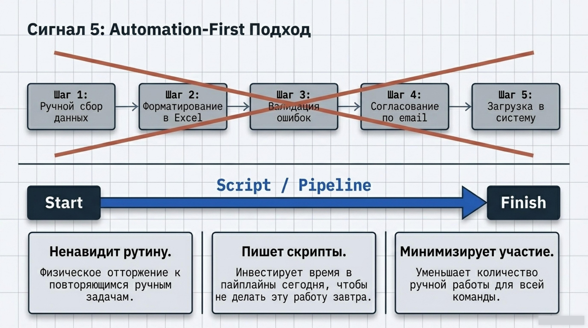

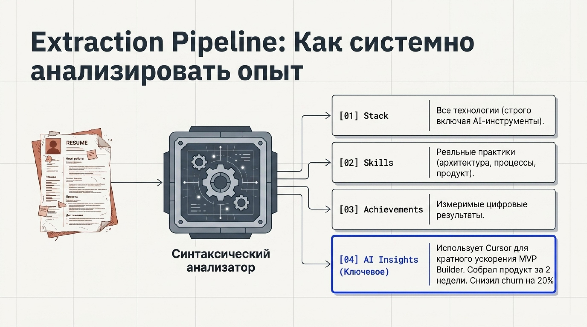

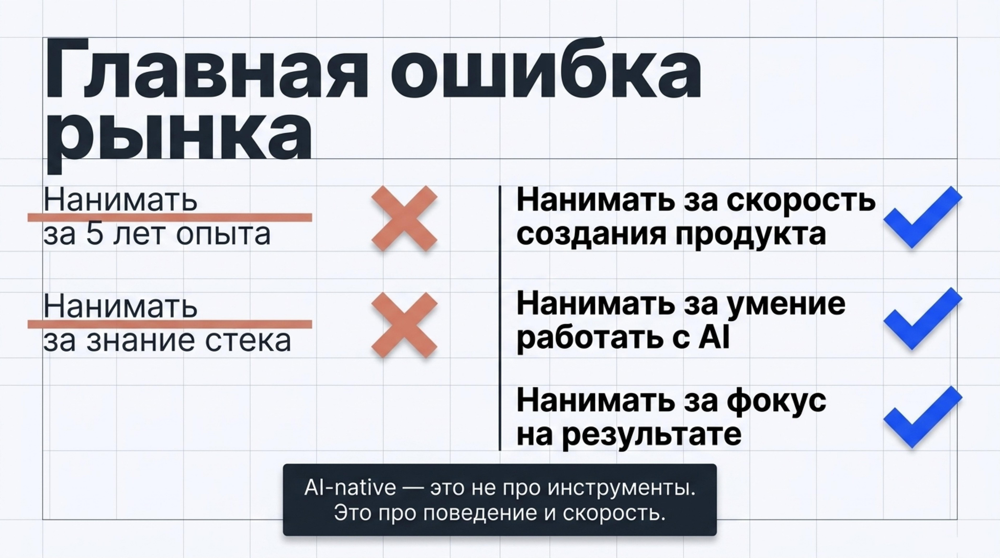

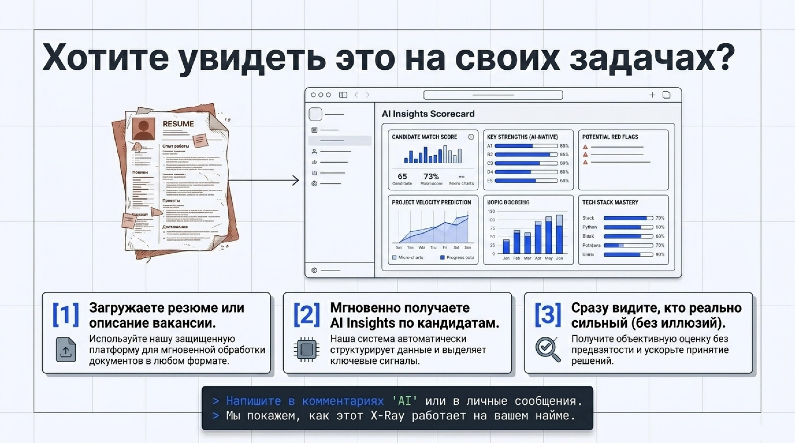

Сейчас все ищут "сильных разработчиков".

Но проблема в том, что рынок уже разделился на 2 типа:

1. **Обычные инженеры**

2. **AI-native инженеры**, которые делают в 5-10 раз больше

И если вы нанимаете по старым критериям - вы почти гарантированно берёте первых.

---

## 💥 Почему стандартный найм ломается

Вы смотрите на:

* стек (React, Python, PostgreSQL)

* годы опыта

* прошлые компании

Но это **ничего не говорит о реальной эффективности**.

Два кандидата могут выглядеть одинаково. Но один будет делать фичу 2 недели, а второй - соберёт весь продукт за выходные.

---

## 🧠 Что отличает AI-native разработчика

Мы сейчас системно анализируем опыт кандидатов и выделяем **AI Insights** - сигналы того, как человек реально работает.

Вот на что стоит смотреть:

---

### 🔹 1. Использование AI как multiplier

Не "пробовал ChatGPT", а:

* Cursor / Claude / Copilot в ежедневной работе

* генерация кода, тестов, архитектуры

* работа через агенты

👉 Если этого нет - это не AI-native

---

### 🔹 2. Скорость (самый недооценённый сигнал)

Ищите формулировки:

* "собрал MVP за 2 недели"

* "делали 5+ экспериментов в неделю"

* "запустили продукт за месяц"

👉 скорость - главный маркер

---

### 🔹 3. Product thinking

AI-native инженер:

* говорит про churn / retention / conversion

* а не только "реализовал API"

* участвует в продуктовых решениях

---

### 🔹 4. End-to-end мышление

Не "я делал backend", а:

* "собрал фичу от идеи до продакшена"

* "запустили и измерил результат"

---

### 🔹 5. Automation-first подход

* автоматизирует рутину

* пишет скрипты / пайплайны

* уменьшает ручную работу

---

## ⚙️ Как мы это делаем

Мы разбираем каждый опыт кандидата на структуру:

* **stack** → все технологии (включая AI-инструменты)

* **skills** → реальные практики (product, архитектура, процессы)

* **achievements** → измеримые результаты

* и главное → **AI Insights с объяснением**

Например:

> **AI-native** - использует Cursor и Claude для кратного ускорения разработки
>
> **MVP Builder** - собрал продукт за 2 недели
>
> **Product Engineer** - снизил churn на 20%

---

## 📊 Что это даёт

Вы начинаете видеть разницу:

* не "React vs React"

* а

* **обычный разработчик vs человек, который реально делает продукт**

---

## ⚡ Главная ошибка рынка

Компании до сих пор нанимают:

❌ "5 лет опыта"

❌ "знание стека"

Вместо:

✅ "скорость создания продукта"

✅ "умение работать с AI"

✅ "фокус на результате"

---

## 🎯 Если коротко

> AI-native разработчик - это не про инструменты
>
> это про **поведение и скорость**

---

## 👇 Если хотите попробовать

Мы сделали простой сценарий:

* загружаете резюме или вакансию

* получаете **AI Insights по кандидатам**

* сразу видно, кто реально сильный
