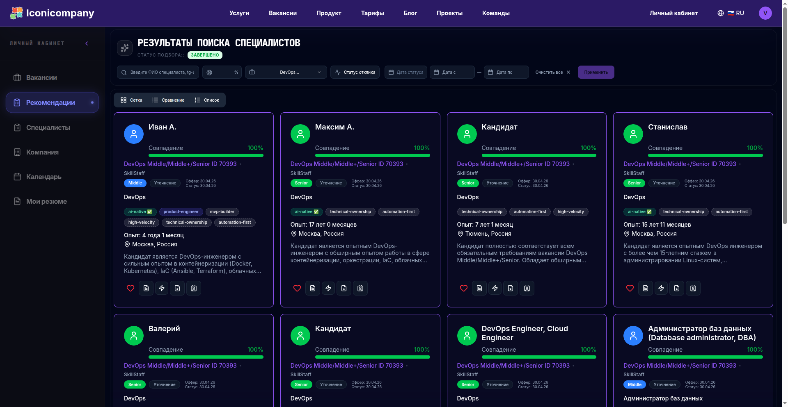
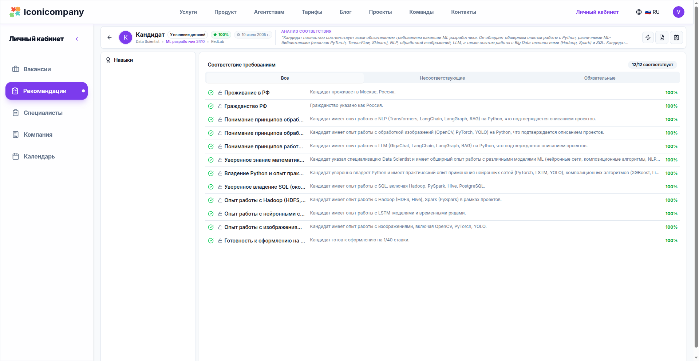
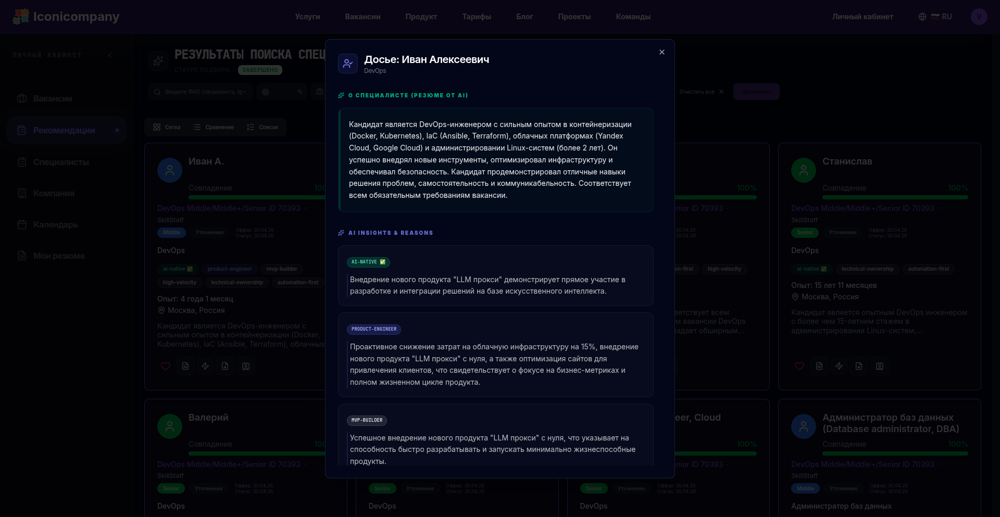
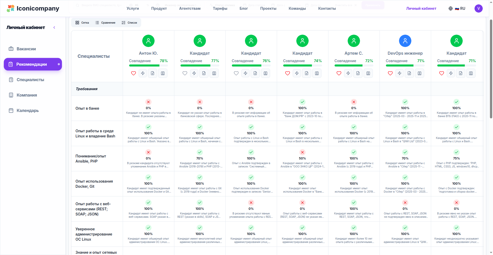
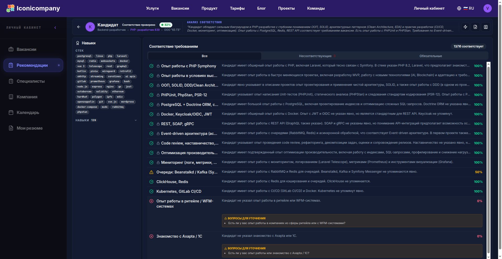
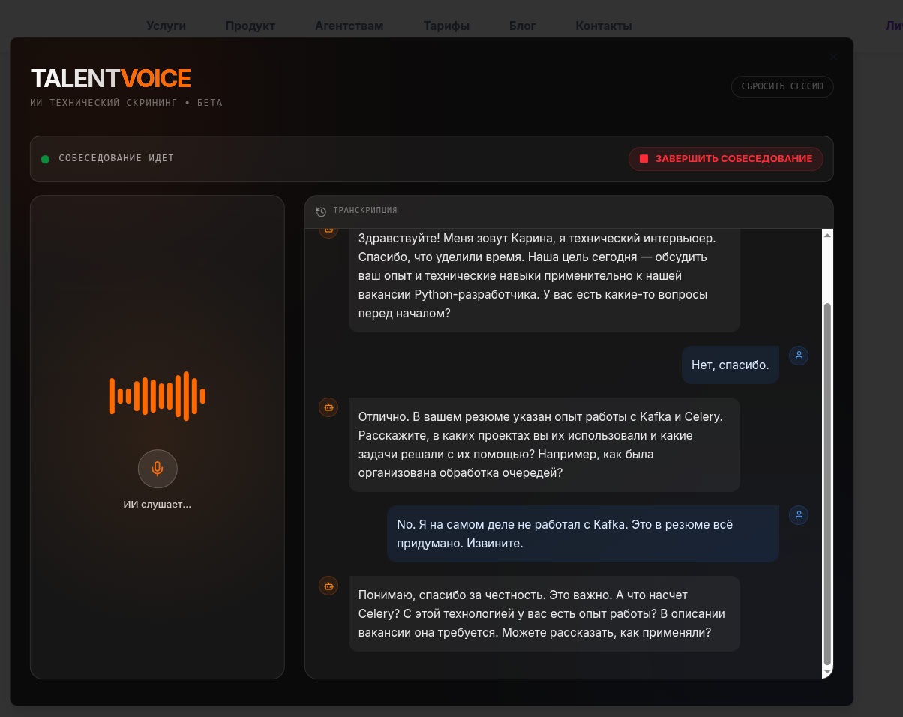

**Рекрутинг сломан.**
Не потому что нет кандидатов.
А потому что процесс - это хаотичный набор действий без системы.
**Iconicompany** - это попытка собрать найм как **инженерный pipeline**, а не HR-рутину.

Платформа обрабатывает **500+ вакансий в месяц** и закрывает весь цикл:
от сигнала о вакансии → до кандидата, который уже прошёл скрининг.

---

## Кто на платформе

Iconicompany объединяет три стороны:

1. **Заказчики** — компании, которые хотят нанимать быстро и без "мусорных" резюме.
2. **Агентства** — профессиональные рекрутеры, использующие наши AI-инструменты как "экзоскелет" для своей работы.
3. **Специалисты** — кандидаты с рынка, которые получают релевантные предложения и прозрачный процесс.

Платформа автоматизирует **подбор и детальный матчинг** по сложным техническим требованиям, сокращая время на поиск в десятки раз.

---

## 1. Вакансии появляются сами

Вместо ручного создания - система автоматически собирает вакансии из Telegram-каналов.
Можно добавить вручную, но в реальности - поток уже есть.

---

## 2. Кандидаты через 1 минуту (не по ключевым словам)

Через минуту после публикации - список кандидатов.

Но ключевое - **это не keyword matching**.

Система понимает смысл:

> "data visualization" = "дашборды в Tableau"

👉 Это уже не поиск.
Это **семантический матчинг в векторном пространстве**.

---

## 3. 100% match - не маркетинг, а модель

Каждому кандидату считается **Match Score**.

Это не "похож/не похож", а разложение по навыкам, опыту и контексту.

👉 Важный момент:
мы не ищем "идеального кандидата"
мы считаем **вероятность fit-а**.

---

## 4. AI-нативный профиль: что мы извлекаем

Система не просто хранит резюме, она создает **динамический цифровой профиль** на основе анализа всего опыта. Используя LLM, мы вытаскиваем:

- 🛠 **Stack**: не просто "Python", а конкретные библиотеки, версии БД и элементы инфраструктуры.
- 🎯 **Skills**: методологии (Agile, TDD), бизнес-процессы и софт-скиллы, подтвержденные опытом.
- 🏆 **Achievements**: измеримые результаты (метрики, запущенные продукты).
- 👥 **Team & Context**: в какой команде работал человек и какую роль в продукте играл.

**Главная фишка — AI-теги:**
Система автоматически маркирует кандидатов:
- `ai-native` — использует Cursor/Claude для десятикратного ускорения.
- `product-engineer` — берет ответственность за бизнес-метрики.
- `high-velocity` — строит продукты от 0 до 1 в рекордные сроки.

---

## 5. Сравнение = принятие решения

Если кандидатов несколько - включается режим сравнения.

По конкретным требованиям.
Без субъективного "кажется норм".

👉 И здесь же происходит магия:

**лайк → автоматический контакт**

Без рекрутера как узкого места.

---

## 6. Система сама уточняет опыт

Резюме всегда неполное.
И почти всегда устаревшее.

Система генерирует вопросы:

- уточняет стек
- проверяет глубину
- вытаскивает скрытый опыт

---

## 7. Кандидат дополняет себя сам

После лайка кандидат получает ссылку
и дополняет профиль:

👉 что реально делал

👉 с чем работал, но не указал

Это убирает 50% шума на этапе скрининга.

---

## 8. Голосовой AI вместо первичного интервью

Финальный этап - голосовой скрининг.

AI проверяет:

- реальные знания
- глубину понимания
- адекватность ответов

Или сразу даёт слот на интервью.

---

# Что это меняет

Рекрутинг перестаёт быть:

- ручным
- медленным
- субъективным

И становится:

→ **pipeline с метриками**

→ **системой принятия решений**

→ **инженерной задачей**

---

# Итог

**Iconicompany** - это не "ещё один ATS".

Это попытка ответить на вопрос:

> как бы выглядел найм, если бы его изначально строили инженеры, а не HR?

Если коротко:

👉 вакансия → 1 минута → кандидаты

👉 кандидат → уточнение → скрининг

👉 на выходе → уже проверенный человек

Без хаоса. Без "давайте созвонимся".

---

## Стек и команда

Мы строим платформу на острие технологий:

- **Backend:** Bun, ElysiaJS, PostgreSQL (Drizzle), MongoDB.
- **Workflows:** Temporal (для надежных бизнес-процессов).
- **AI Core:** Google Gemini 2.5 Flash, OpenAI, LangChain.
- **Frontend:** Next.js 16+, React 19, Tailwind CSS.

**Команда Iconicompany** — это инженеры, которые делают инструменты для инженеров. Мы верим, что в 2026 году рекрутинг должен быть таким же предсказуемым, как деплой в Kubernetes.
