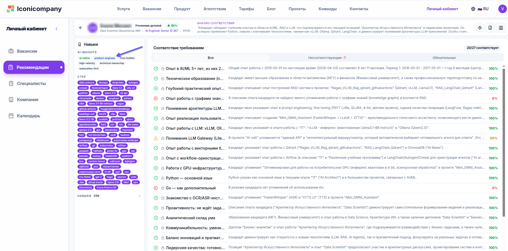

Внедрение **AI Insights** в анализ опыта кандидатов радикально меняет подход к подбору персонала, делая процесс более точным и эффективным. Мы начали извлекать AI Insights из опыта кандидатов, и это сильно трансформирует процесс найма.

## 💡 Старый Подход

Раньше процесс подбора часто сводился к:

*   стек (React, Python, PostgreSQL)
*   список навыков
*   годы опыта

...и попытке угадать, "подойдёт или нет".

## 💡 В чем Проблема

Резюме не отвечало на главный вопрос:

> **этот человек реально делает продукт - или просто выполняет задачи?**

## ⚙️ Что Мы Сделали

Мы добавили слой **структурированного анализа опыта**.

Теперь мы разбираем каждый опыт кандидата на:

*   **stack** → все технологии (включая AI-инструменты типа Cursor, Claude и т.д.)
*   **skills** → реальные практики (product discovery, A/B тесты, архитектура, управление)
*   **achievements** → конкретные измеримые результаты
*   **project context** → что именно строил человек

И главное:

### 💡 Мы Извлекаем AI Insights

Мы ищем не "ключевые слова", а **сигналы того, как человек реально работает**:

*   **AI-native**: Использует AI как множитель, а не как игрушку
*   **Product Engineer**: Думает метриками, а не задачами
*   **MVP Builder**: Собирает продукты с нуля за дни/недели
*   **High Velocity**: Делает в разы быстрее рынка
*   **Technical Ownership**: Отвечает за результат, а не "свою часть"
*   **Automation First**: Автоматизирует всё, что можно

## ⚙️ Как Это Работает Под Капотом

Мы не просто парсим текст. Мы:

1.  **Декомпозируем опыт по структуре**
    (технологии, процессы, результат, команда)

2.  **Ищем поведенческие сигналы**

    *   "собрал MVP за 2 недели"
    *   "5 экспериментов в неделю"
    *   "снизил churn на 20%"

3.  **Формируем AI Insights с объяснением**

    Не просто:

    > AI-native

    А:

    > AI-native - использует Cursor и Claude для кратного ускорения разработки

## ✅ Что Это Даёт

Теперь видно то, чего раньше не было:

*   два кандидата с одинаковым стеком
*   но один → обычный разработчик
*   второй → **AI-native product engineer**

И разница между ними - **x5-x10 по результату**.

## 🚨 Самое Важное

Рынок всё ещё нанимает:

❌ "5 лет React"

❌ "знание SQL"

Хотя нужно:

✅ "соберёт продукт за неделю"

✅ "поймёт пользователя и доведёт до метрик"

## ⚡ Вывод

Мы перестаём искать "разработчиков". Мы начинаем находить:

> **тех, кто реально создаёт продукт**

И **AI Insights** - это то, что делает их видимыми.

Если хочешь - покажу реальные примеры, где это полностью меняет выбор кандидата.

---

## 📚 Читайте также

- [AI-опыт: как перестать конкурировать с тысячами кандидатов](ai-experience-job-market)
- [AI-native Разработчик: Новая Эра Продуктовой Разработки](ai-native-developer-new-era-product-development)
- [AI - это не про промпты](ai-not-about-prompts)
- [Идеальное резюме: AI-конвейер и баланс обязанностей vs достижений](ai-resume-pipeline-balance)
- [AI: От Skills к Системам - Почему Blueprints меняют все](ai-skills-blueprints-systems)
