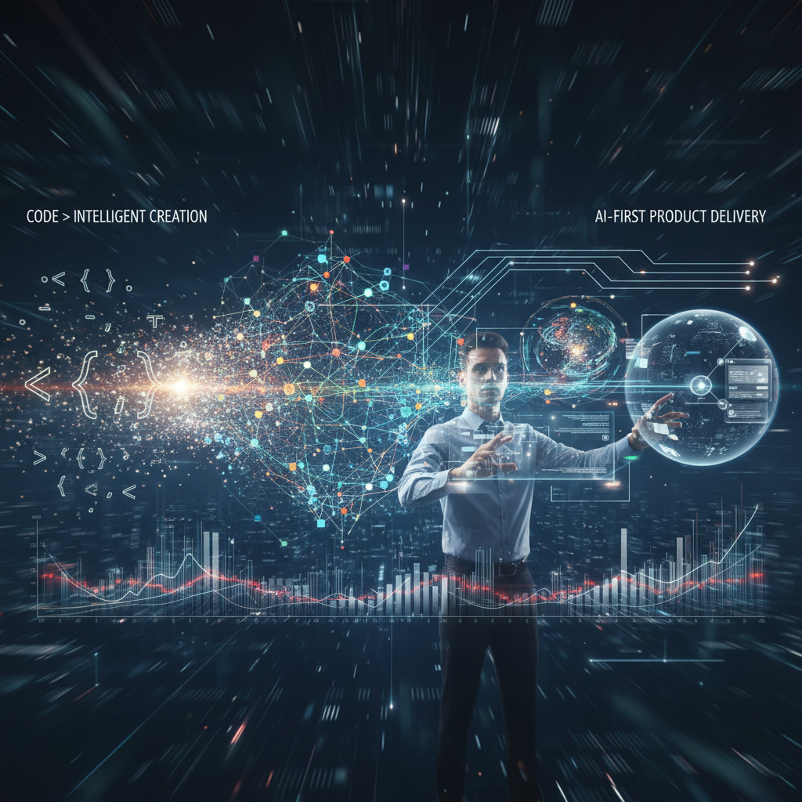

The IT market is evolving faster than job descriptions can keep up. We see it daily: traditional labels like "Java developer" or "React engineer" are fading, giving way to a new engineering culture.

### 🚀 What Has Changed?

Today, an engineer's value is defined not just by syntax or framework knowledge, but by the ability to transform an idea into a working production service with minimal friction.

**We are looking for those who:**

*   🤖 **Leverage AI as a force multiplier:** Not just "heard about Copilot," but integrated LLMs into their daily workflow to automate routine tasks and focus on architecture.

*   🎯 **Think product-first:** Understand why a microservice is being written and what business problem it solves.

*   ⚙️ **Automate everything:** If a task can be avoided doing manually twice, it should be automated.

*   ✅ **Deliver-first:** A results-oriented individual who can bring a feature to the user, understanding the entire CI/CD pipeline.

### 🛠️ What You'll Be Working With?

We collaborate with major market players (Fintech, High-load, AI Platforms), where challenges extend beyond typical CRUD operations.

**Our current focuses include:**

*   🧠 **AI-native Development:** Creating systems where neural networks are not an add-on, but part of the core.

*   💳 **Complex Fintech:** High-load platform solutions and payment systems.

*   🤝 **Multi-agent Systems:** Developing and implementing agent protocols for business process automation.

### 🌟 Open Roles:

We are currently expanding our teams in the following areas:

1.  💻 **Backend / Frontend / Fullstack** (Stack: Python/Go/Java/Node/React)

2.  🤖 **AI / ML Engineers** (LLM, RAG, Agentic workflows)

3.  ☁️ **DevOps / Platform Engineers** (K8s, High-load infrastructure)

4.  🧠 **Tech Lead** (For those ready to build processes and architecture from scratch)

5.  💡 **Product Engineers** (Developers with a strong product background)

6.  ✨ **AI-native Developers** (Specialists expertly proficient in generative development tools)

### ✨ Why Join Us?

*   ⚡ **Speed over Bureaucracy:** We value time and common sense more than endless meetings.

*   🛠️ **Engineering Freedom:** We choose tools based on the task, not because "that's how it's always been done."

*   🤝 **Strong Community:** Work alongside people who live and breathe technology, constantly exploring new frontiers (from Text-to-SQL to A2A protocols).

**Ready to build the future without legacy mindset?**

👉 Apply now: https://iconicompany.com/jobs

Or connect with our AI agent via Telegram: https://t.me/iconicompanybot to find your perfect role!

---

## 📚 Читайте также

- [Как мы переосмыслили оценку разработчиков: от резюме к голосовому AI-интервью](developer-evaluation-voice-screening)
- [Смерть статического резюме: Почему будущее найма - за сетью цифровых двойников](digital-twins-ai-net)
- [Как мы обрабатывали 5 кандидатов в день и думали, что всё нормально](five-candidates-per-day-normalization)
- [Квест под названием найм](hiring-quest)
- [Как найти AI-native разработчика (и не ошибиться)](how-to-find-ai-native-developer)
