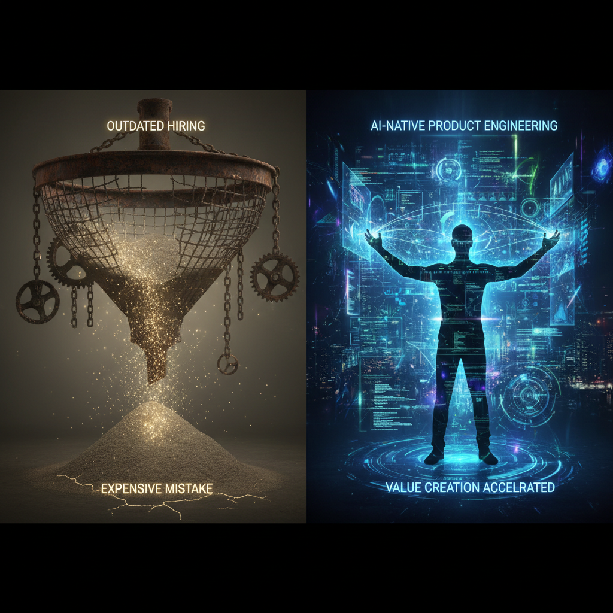

## Самая дорогая ошибка в IT - это не плохой код. Это ваше интервью

Большинство компаний относятся к найму как к воронке: пропусти через неё достаточно кандидатов, и на выходе останутся лучшие. Но что, если сам фильтр не просто засорился, а изначально спроектирован так, что задерживает «песок» и смывает «золото»?

Я наблюдаю за рынком найма в IT уже почти 20 лет. И чем дальше мы заходим в эпоху AI-native разработки, тем очевиднее становится: классическое техническое интервью превратилось в **карго-культ**.

### 1. Мы измеряем не инженерию, а стрессоустойчивость

Классический лайв-кодинг или решение задач на доске - это не проверка навыков программирования. Это проверка способности решать абстрактные задачи под наблюдением в условиях ограниченного времени.

В реальности работа инженера выглядит ровно наоборот:

* ✨ **Вместо изоляции** - глубокий контекст и работа с документацией.

* 🔍 **Вместо запрета на поиск** - умение эффективно гуглить и использовать LLM.

* ⏱️ **Вместо таймера** - работа над качеством, архитектурой и долгосрочной поддержкой.

Мы создаем «фильтр тревожности». В итоге мы нанимаем тех, кто лучше всех справляется со стрессом и заучил паттерны LeetCode, а не тех, кто способен спроектировать отказоустойчивую систему.

### 2. Ловушка модели Дрейфуса: почему эксперты проваливают интервью

Самый глубокий и часто игнорируемый аспект найма - это то, как меняется человеческое мышление с ростом мастерства. Согласно модели братьев Дрейфус, человек проходит путь от Новичка до Эксперта.

* 👷‍♀️ **На уровне Competent (Компетентный)** инженер мыслит правилами, алгоритмами и четкими шагами. Он может детально объяснить каждое «почему», потому что его работа - это следование инструкциям.

* 🧠 **На уровне Expert (Эксперт)** мышление перестает быть линейным. Эксперт видит паттерн целиком. Он принимает решение интуитивно, основываясь на тысячах часов опыта (то самое «просто чувствую, что так будет лучше»).

**Парадокс:** Интервьюер (часто уровня Mid/Senior, т.е. «Компетентный») просит Эксперта «разжевать» логику. Эксперт, чье мышление уже перешло на уровень распознавания образов, пытается декомпозировать свою интуицию обратно в правила. Это выглядит неубедительно, скомканно, и интервьюер ставит вердикт: «слабая база, не может объяснить основы».

**Мы отсеиваем лучших, потому что требуем от них думать как середняки.**

### 3. Что именно мы измеряем?

Если процесс не похож на реальный рабочий день, вы измеряете только один навык - **умение проходить интервью**.

В 2026 году разница между «просто разработчиком» и топовым инженером стала не десятикратной, а стократной ($x100$). Но эта разница проявляется не в знании синтаксиса, а в вещах, которые сложно засунуть в чек-лист:

* 💡 **Product Thinking:** понимает ли он, зачем мы вообще пишем этот код?

* 🚀 **AI-multiplication:** умеет ли он использовать агентов и LLM, чтобы доставить результат в 5 раз быстрее?

* 🌪️ **Работа с неопределенностью:** что он делает, когда вводные меняются трижды за неделю?

### 4. Наш подход в Iconicompany

Мы в Iconicompany пришли к тому, что классические резюме и стек - это «слабые сигналы». Они говорят о прошлом, но ничего не говорят о способности создавать будущее.

Мы переходим к модели **Business Scenarios**:
Вместо «напиши разворот дерева», мы спрашиваем: «У нас проблема в биллинге, пользователи теряют транзакции при переходе на новый API. Как бы ты подошел к решению, учитывая ограничения нашего стека?».

Здесь нет правильного ответа в конце учебника. Здесь есть:

* ❓ Умение задавать уточняющие вопросы.

* 📊 Способность видеть бизнес-риски.

* ⚡ Скорость принятия решений.

### 5. Найм как инженерная задача

Пора признать: найм - это уже не HR-функция. Это задача **retrieval + signal ranking under uncertainty**.

Если ваша компания до сих пор нанимает так же, как в 2010-х, вы конкурируете за тех, кто умеет решать головоломки, в то время как ваши конкуренты забирают тех, кто умеет строить продукты.

### Как мы это делаем в Iconicompany: поиск «инженеров-единорогов»

В последнее время мне всё чаще приходится откладывать написание кода и брать на себя роль hiring-менеджера. Мы ищем **продуктовых инженеров**.

Для меня это настоящие «единороги» ИТ-рынка - редкий вид специалистов, уникальный сплав хардкорного инженерного бэкграунда и продуктового мышления. Это люди, способные в одиночку «запилить» продукт (внутренний или внешний), используя AI-инструменты как мощный мультипликатор.

На рынке полно классных разработчиков, опытных продактов и крепких CTO. Но тех, кто может сам составить PRD, выстроить свой SDLC вокруг AI, договориться со стейкхолдерами и выдать готовый результат без армии менеджеров над душой - единицы. Обычно это люди с опытом собственных стартапов, которые понимают: код - это просто средство доставки ценности.

Вот список вопросов, которые я задаю на интервью (после HR-скрининга, но до глубокого тех-селла). Они проверяют не знание синтаксиса, а готовность работать в парадигме **AI-first**.

#### Блок 1: AI-Native SDLC (Инженерная скорость)

Мы не спрашиваем, как работает «под капотом» HashMap. Мы спрашиваем, как кандидат ускоряет свою работу в 5-10 раз.

> 💻 **1. Твой ежедневный AI-setup: инструменты, IDE, модели?**
> Мы хотим услышать не просто «иногда пользуюсь ChatGPT», а конкретику: Cursor, Claude Code (CC), Windsurf. Какие модели под какие задачи? Если человек не использует AI-native IDE в 2026 году - он уже проигрывает в скорости.

> 🔄 **2. Как AI интегрирован в твой цикл разработки (SDLC) и что он изменил?**
> Здесь важно понять, как поменялся процесс. Стал ли кандидат писать больше тестов (потому что их теперь генерит агент)? Стал ли он чаще прототипировать? Нам нужен человек, который перестроил процесс, а не просто копипастит куски кода.

> 📦 **3. Реальный пример: что ты зашипил значительно быстрее благодаря AI-агентам?**
> Оцениваем боевой опыт. Идеальный ответ: «Мне нужно было поднять сервис на Rust, на котором я раньше не писал. Я взял Claude Code, скормил ему референсы и план - и через день мы уже были в проде».

#### Блок 2: Контроль качества и «AI Slop»

AI может генерировать тонны мусорного кода. Продуктовый инженер должен уметь фильтровать этот поток.

> 🧐 **4. Как ты валидируешь код от нейронок, чтобы не плодить «AI-шлак»?**
> Хороший ответ включает проектирование спеков и тестов *до* генерации. Мы ищем тех, кто сначала обсуждает архитектуру с агентом, составляет план и только потом отдает задачу на реализацию в CC.

> ⚖️ **5. Где проходит грань твоего доверия к AI?**
> Эксперт никогда не отдаст нейронке принятие продуктовых решений или верхнеуровневое планирование. План и чеклисты - на человеке, реализация и ревью - на агенте (под присмотром). Нам важно услышать историю о том, как кандидат поймал критическую ошибку AI до того, как она попала в мастер.

> ✅ **6. Как ты проводишь ревью кода после агента?**
> Мы ищем прагматиков. Использование BugBot или других AI-решений для первичного ревью - это норма. Но финальное понимание «почему это сделано именно так» остается за инженером.

#### Блок 3: Ownership и Автономия

Продуктовый инженер - это мини-CEO своей фичи или домена.

> 👑 **7. Расскажи о проекте, которым ты владел «от и до» (от дизайна до тестов).**
> Что значило «владеть» проектом в ежедневном режиме? Как ты общался со стейкхолдерами, как делал демо и как составлял роадмап? Нам нужен драйвер, а не исполнитель.

> 📉 **8. Как ты балансируешь между техдолгом и новыми фичами, когда ты - единственный принимающий решения?**
> Это вопрос на зрелость. Как ты понимаешь, где можно «срезать углы» ради скорости, а где архитектура должна быть монументальной? Умение аргументированно отказать стейкхолдеру в пользу стабильности - критический навык.

> 🎯 **9. Как устроена твоя система самоорганизации без надзора менеджера?**
> Высокая скорость требует жесткой дисциплины. Трекеры, напоминалки, документация - нам важно, чтобы человек сам управлял своим временем и приоритетами, а не ждал пинка от PM.

### Вместо итога

Найм таких **универсалов** - это не про поиск тех, кто вызубрил ответы на вопросы. Это поиск людей, которые кайфуют от возможности **создавать больше меньшими силами**.

Если инженер говорит: «Я не пишу тесты, потому что нет времени», - он нам не подходит. Если он говорит: «Я научил агента писать тесты за меня, и теперь мы шипим в 3 раза чаще», - это наш человек.

Рынок изменился. Инструменты изменились. Пора менять и то, как мы оцениваем людей, которые эти инструменты используют.

**А какой ваш любимый вопрос, чтобы «расколоть» кандидата на наличие продуктового мышления?**

---

## 📚 Читайте также

- [AI-native Разработчик: Новая Эра Продуктовой Разработки](ai-native-developer-new-era-product-development)
- [AI-native Product Engineer: A New Class, Not Just Another Developer](ai-native-product-engineer-new-class-not-just-another-developer)
- [Смерть «синьора обыкновенного»: почему ваше резюме больше не говорит о продуктивности](the-demise-of-the-ordinary-senior-developer-ai-impact)
- [Why IT Hiring Is Broken and How to Fix It with Behavioral Signals](why-it-hiring-broken-fix-behavioral-signals)
