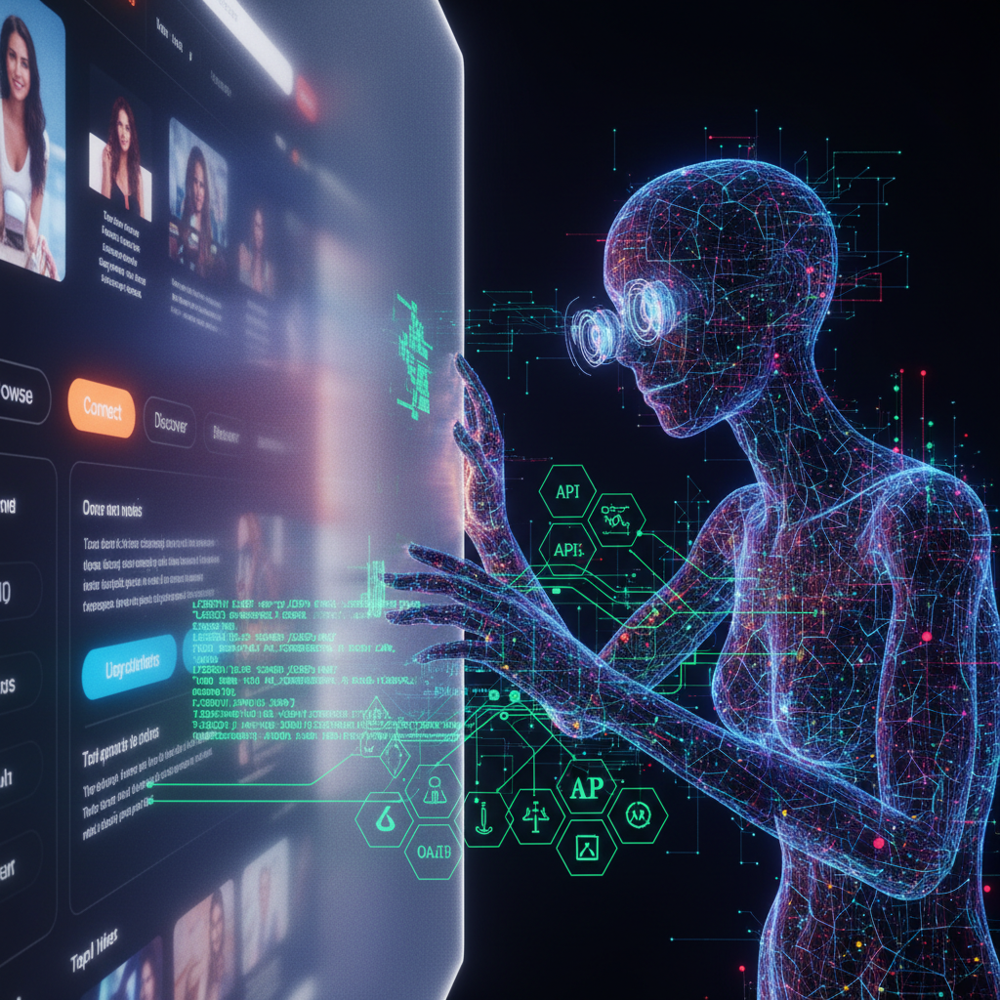

Большинство сайтов сегодня существуют только для людей. Мы годами полировали UX, выверяли отступы в кнопках и боролись за миллисекунды в LCP (Largest Contentful Paint). Но интернет начал стремительно меняться.
Теперь сайт должен быть доступен не только браузеру, но и AI-агентам. И как выяснилось, в этом новом мире почти весь современный веб - это «черный ящик» с закрытыми дверями.

## Смена парадигмы: от интерфейса к протоколу
Раньше архитектура взаимодействия выглядела линейно:
**Browser → Frontend → Backend**
Сегодня появляется новый слой, который вклинивается между пользователем и данными. Это не просто «умный поиск», это автономный исполнитель. Его цепочка выглядит иначе:
**Agent → Protocol → Tools → Context**
LLM не «смотрит» сайт в привычном нам понимании. Когда агент заходит на ваш ресурс, он пытается лихорадочно найти ответы на вопросы:
🔎 Что вообще умеет эта система?

⚙️ Как получить сырые данные, а не распарсенный HTML?

🔒 Как авторизоваться без участия человека?

🛠️ Какие действия (tools) доступны прямо сейчас?

🗺️ Где лежит спецификация API?

❓ Каковы лимиты и ограничения?

И тут внезапно оказывается, что большинство сайтов для агентов «слепые». У них нет API discovery, метаданных OAuth, поддержки MCP или любого другого машиночитаемого контекста.

## Мы снова в «эпохе дикого веба»
По сути, мы заново проживаем ранний этап становления интернета, но на другом уровне абстракции. Происходит глобальная трансформация понятий:
🔄 **SEO (Search Engine Optimization)** превращается в **GEO (Generative Engine Optimization)**. Важна не позиция в выдаче, а вероятность того, что агент выберет ваш сервис для решения задачи.

🌐 **Website** превращается в **Agent Endpoint**. Сайт - это больше не набор страниц, а точка входа в исполнительную среду.

Через пару лет понятие «доступность сайта» (accessibility) перестанет ассоциироваться только со screen readers для слабовидящих. Теперь это **Machine Accessibility** - способность ИИ-систем беспрепятственно оперировать вашим функционалом.

### Сравнение подходов: Human-centric vs Agent-centric
| Характеристика | Сайт для человека | Сайт для агента |
|---|---|---|
| **Интерфейс** | UI / Графика | API / MCP / JSON-RPC |
| **Навигация** | Ссылки и меню | Discovery endpoints / Спецификации |
| **Авторизация** | Форма логина / MFA | OAuth / OIDC Metadata / Scopes |
| **Понимание** | Интуиция и опыт | Structured Metadata / Context |
| **Результат** | Визуальное отображение | Structured data / Action confirmation |

## Почему robots.txt и .well-known снова в моде
Внезапно оказалось, что старый добрый robots.txt начинает выглядеть как примитивный контракт API. Но его уже недостаточно. Чтобы агент мог работать эффективно, ему нужно понимать структуру безопасности.
Именно поэтому метаданные **OAuth/OIDC** становятся критически важными. Агенту мало «видеть» защищенный ресурс. Ему нужно программно понять:
🔑 Как получить access token?

🏢 Где находится Issuer?

🔐 Какие scopes (права доступа) существуют?

💬 Как работать с защищенными ресурсами без гадания на кофейной гуще?

Путь к /.well-known/oauth-protected-resource - это больше не «enterprise overengineering». Это фундамент machine-readable web. Человек может открыть UI и разобраться руками, используя интуицию. У агента её нет - у него есть только протоколы и discovery.

## MCP: Новый REST для эпохи ИИ
Сейчас многие воспринимают **MCP (Model Context Protocol)** как еще один модный протокол от Anthropic. Но на самом деле происходит нечто более глобальное.
LLM перестает быть просто чат-интерфейсом. Она становится **runtime-средой**, которая вызывает инструменты и оркестрирует системы.
*   **Раньше:** API были для разработчиков, чтобы они могли написать интеграцию.
*   **Теперь:** API становятся средой прямого взаимодействия ИИ-систем.
Проблема в том, что сайты пока не умеют объяснять агенту свои Skill-сеты. В ближайшем будущем мы увидим расцвет:
⭐ **MCP Server Cards** - визитные карточки возможностей сервиса.

🔍 **Capability Discovery** - автоматическое определение того, что агент может сделать на сайте (купить, забронировать, рассчитать).

🤝 **Tool Negotiation** - процесс, в котором агент и сервер договариваются о формате передачи параметров.

## Итог: Self-describing Execution Environment
Мы начинаем проектировать системы не для frontend-клиентов, а для автономных runtime-агентов. Сайт постепенно эволюционирует из набора HTML-страниц в **самодокументированную среду исполнения**.
Выигрывать будут те системы, которые станут «Agent-ready». Даже если у них будет посредственный UI, AI-агенты будут приводить в них пользователей автоматически, потому что именно с этими системами им проще всего «договориться».
Через несколько лет фраза: *«Наш сервис поддерживает MCP и имеет полную спецификацию в /.well-known»* будет звучать так же обыденно, как сегодня звучит фраза: *«У нас есть адаптивная верстка»*.
**Вопрос только в том, увидит ли ваш сайт агент, который придет на него завтра?**

---

## 📚 Читайте также

- [«Вас не существует»: почему текущая авторизация убивает ваш бизнес в мире AI-агентов](you-dont-exist-why-current-authorization-kills-your-business-in-ai-agent-world)
- [Ваш AI-agent бесполезен, если он не учится](ai-agent-self-evolution)
- [AI-опыт: как перестать конкурировать с тысячами кандидатов](ai-experience-job-market)
- [AI - это не технология. Это консалтинг (и почему ваш найм сломан по той же причине)](ai-is-consulting-and-why-your-hiring-is-broken)
- [AI - это не про промпты](ai-not-about-prompts)
