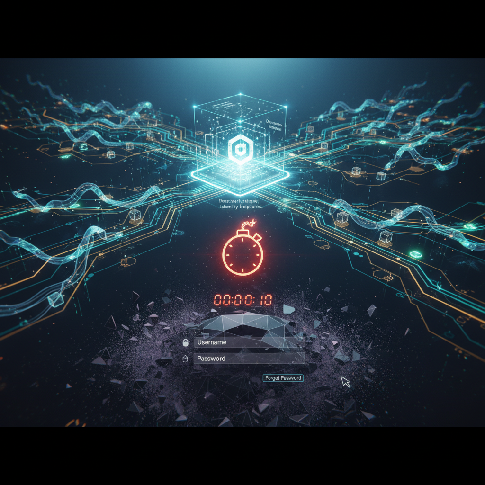

# «Вас не существует»: почему текущая авторизация убивает ваш бизнес в мире AI-агентов

Самая большая ошибка современного архитектора - продолжать верить в то, что ваш сайт или сервис делают для людей.

Давайте без иллюзий: в ближайшие 2-3 года основными «пользователями» вашего продукта станут не люди. Это будут 🤖 **агенты**. AI-ассистенты, автономные закупщики, рекрутинговые боты и AI-разработчики, которые интегрируются в ваш бэкенд напрямую, минуя красивые лендинги.

И вот здесь заложена 💣 бомба замедленного действия: **ваш бэкенд к ним абсолютно не готов.**

## Почему текущая модель авторизации ломается

Сегодняшний стек авторизации строился вокруг человека перед монитором. Мы привыкли к цепочке:

*   🍪 Cookie / Session.

*   📝 Login-формы через UI.

*   🔑 OAuth, заточенный под «фронт» и редиректы в браузере.

**Но агент не ведет себя как человек:**

1.  ❌ Он не кликает по кнопкам.

2.  ❌ Он не проходит капчу и формы.

3.  ❌ Он не будет «логиниться» через ваш UI.

Его цикл: ⚙️ **API → Данные → Действие.** Если у вас нет машиночитаемой точки входа, для него ваш продукт просто не существует. Вы 👻 невидимы в новой экосистеме AI-native интернета.

## Новая модель: Machine-to-Machine Identity

В AI-native мире авторизация - это не «вход пользователя». Это 🤝 **динамический контракт между агентами.**

Это мир, где:

*   🚫 Нет UI.

*   👤➡️🚫 Нет человека в цикле авторизации.

*   🔒❌ Нет связки логин/пароль.

*   🌐 **Есть только протоколы.**

Чтобы агент мог воспользоваться вашим сервисом, он должен сначала «понять», как с вами разговаривать. И здесь мы переходим от документации, написанной для людей, к стандартам Discovery.

## Базовый слой: OAuth / OIDC Discovery

Первое и самое критичное, что должен уметь AI-native сервис - 📖 **описывать самого себя.** Агент не будет идти в вашу базу знаний или Notion, чтобы прочитать, как получить токен. Он сделает запрос к стандартизированному эндпоинту:

GET /.well-known/openid-configuration

Именно этот конфиг становится «паспортом» вашего сервиса для внешнего AI-мира. Благодаря ему агент мгновенно понимает:

1.  📍 Где авторизоваться.

2.  🪙 Где получить токен.

3.  🏷️ Какие типы доступа (scopes) существуют.

4.  ✅ Как проверить подлинность ответов.

## Что нужно реализовать прямо сейчас (Minimal Viable Agent-Friendly Auth)

Если вы хотите, чтобы ваш API стал «обнаруживаемым», минимальный набор полей в /.well-known/openid-configuration (или /.well-known/oauth-authorization-server) должен включать:

*   🆔 **issuer** - идентификатор вашего сервера.

*   🔗 **authorization_endpoint** - куда агент должен направить запрос на доступ.

*   🔑 **token_endpoint** - эндпоинт для обмена грантов на токены.

*   🔐 **jwks_uri** - адрес, где лежат публичные ключи для верификации ваших подписей.

*   🛠️ **grant_types_supported** - какие методы авторизации вы поддерживаете (например, client_credentials для чистых M2M взаимодействий).

Это не формальность. Это 📜 **публичный контракт**, который делает ваш API частью глобальной сети агентов.

## Где сейчас теряется рынок

Большинство компаний совершают три фатальные ошибки:

1.  ⛔ **Закрытые API:** «Сначала напишите в продажи, мы дадим ключ». AI-агент не будет писать в продажи. Он выберет конкурента, чей API открыт для автоматического подключения.

2.  🚴‍♂️ **Кастомная авторизация:** Изобретение своих велосипедов вместо использования OIDC. Агент «заточен» под стандарты. Кастом для него - это шум.

3.  📚 **Документация «только для людей»:** Если описание вашего API лежит только в PDF или на закрытом портале, для AI-агента его не существует.

> ✨ **Ключевой инсайт:** Раньше пользователь искал ваш продукт. Теперь агент решает, использовать вас или нет. И решение он принимает по одному критерию: можно ли к вам подключиться автоматически и прямо сейчас.

## Что это дает бизнесу?

Если вы внедряете Machine-to-Machine Identity сегодня:

*   🚀 **Интеграции без Sales и Onboarding:** Любой агент подключается к вам программно за миллисекунды.

*   📈 **Масштабируемость:** Ваш продукт становится узлом в сети AI-native интернета, а не изолированным островом.

*   💰 **Ликвидность сервиса:** Ваши функции начинают потребляться другими AI-системами в фоновом режиме, принося доход 24/7 без участия человека.

💡 **Вывод прост:** если у вас нет .well-known/openid-configuration, вы не просто теряете трафик. Вы вылетаете с рынка, который только строится.

### Что дальше?

Авторизация - это только входная дверь. В следующих статьях мы разберем:

1.  📖🤖 **Machine-readable API:** Как сделать ваши контракты (Swagger/Markdown) понятными для LLM без галлюцинаций.

2.  🗣️🤝 **Agent-to-agent коммуникация:** Зачем вам MCP (Model Context Protocol) и как агенты будут договариваться между собой.

3.  🛒🤖 **AI-commerce:** Как позволить агентам совершать сделки и оплачивать услуги автономно.

**P.S.** Если вы не уверены, видит ли ваш API современный AI-агент, или хотите превратить свой сервис в AI-native точку входа - пишите в комментарии или в личку. Разберем ваш кейс и посмотрим, где «затыки» в архитектуре.

---

## 📚 Читайте также

- [AI-опыт: как перестать конкурировать с тысячами кандидатов](ai-experience-job-market)
- [AI-native Product Engineer: A New Class, Not Just Another Developer](ai-native-product-engineer-new-class-not-just-another-developer)
- [AI - это не про промпты](ai-not-about-prompts)
- [Идеальное резюме: AI-конвейер и баланс обязанностей vs достижений](ai-resume-pipeline-balance)
- [AI: От Skills к Системам - Почему Blueprints меняют все](ai-skills-blueprints-systems)
