## 🏦 Проект: Кредитный конвейер для банка

### 📌 Контекст (as-is состояние)

Мы начали с работы над legacy-системой кредитного процесса в банке.

Система представляла собой классический монолит, в котором были смешаны:

* прием кредитной заявки
* проверка клиента
* обработка залога
* формирование кредитного досье
* оформление сделки
* интеграции с внешними сервисами (КИ, залоги, CRM, АРМ агента)

Проблемы системы:

* жёсткая связанность модулей внутри монолита
* длительное время обработки заявки
* отсутствие прозрачного контроля этапов
* частые сбои при интеграциях
* невозможность масштабировать отдельные этапы (например, проверку залога)
* сложность внедрения новых правил и продуктов

Фактически это был "большой поток данных", который падал при любой нестабильности одного из компонентов.

---

## 🎯 Цель трансформации

Мы поставили задачу:

* декомпозировать монолит на независимые доменные модули
* обеспечить управляемый оркестратор бизнес-процесса
* повысить устойчивость кредитного конвейера
* внедрить автоматизацию обработки документов с использованием ИИ
* сделать систему масштабируемой по каждому этапу

---

## 🧩 Декомпозиция на домены

Мы разбили систему на независимые доменные контуры:

### 1. 📥 Прием заявки (Application Intake)

* единая точка входа для заявок (CRM / партнеры / АРМ агента)
* нормализация данных
* первичная валидация
* дедупликация заявок

---

### 2. 🧾 Проверка клиента и залога (Risk & Collateral Check)

* интеграции с внешними источниками (КИ, реестры, антифрод)
* скоринг клиента
* оценка залогового имущества
* расчет лимитов и условий

---

### 3. 🤖 Формирование досье с использованием ИИ (Document Intelligence)

Один из ключевых модулей трансформации.

Мы внедрили AI-пайплайн:

* загрузка документов (PDF, изображения, сканы)
* OCR и извлечение сущностей
* LLM-обработка для:

* классификации документов
* извлечения ключевых полей (ФИО, суммы, даты, объекты залога)
* проверки полноты досье
* автоматическое формирование структурированного кредитного досье

Результат:

* снижение ручной проверки документов
* уменьшение ошибок при формировании досье
* ускорение этапа подготовки сделки

---

### 4. 📦 Модуль формирования досье (Case Assembly)

* сбор всех результатов проверок
* агрегация данных из разных доменов
* построение единого кредитного кейса
* контроль полноты данных перед финальным решением

---

### 5. ✍️ Оформление сделки (Deal Origination)

* генерация договоров и кредитных документов
* интеграция с ЭДО
* финальное согласование условий
* фиксация сделки в учетных системах банка

---

## ⚙️ Архитектура нового решения

### 🧠 Оркестрация: Temporal

Мы использовали Temporal как ядро управления процессами:

* каждый кредит = отдельный workflow
* каждый этап = activity
* гарантии:

* retry по ошибкам
* сохранение состояния
* восстановление после сбоев
* идемпотентность операций

Temporal позволил превратить кредитный процесс в **наблюдаемый state machine**, а не "скрипт, который иногда падает".

---

### ☸️ Инфраструктура: Kubernetes

Вся система была развернута на Kubernetes:

* каждый доменный модуль - отдельный deployment
* горизонтальное масштабирование:

* отдельно OCR/AI
* отдельно риск-скоринг
* отдельно интеграции
* изоляция отказов между сервисами

---

### 🧱 Микросервисная архитектура

Каждый домен стал отдельным сервисом:

* Application Service
* Risk Service
* Collateral Service
* Document AI Service
* Case Assembly Service
* Deal Service

Коммуникации:

* синхронные вызовы (gRPC/HTTP) для быстрых проверок
* асинхронные события через очереди для тяжелых операций

---

## 🔄 Как выглядит процесс (end-to-end)

1. Поступает кредитная заявка
2. Temporal запускает workflow
3. Параллельно:

* проверяется клиент
* оценивается залог
* запускается AI-обработка документов
4. Данные стекаются в Case Assembly
5. Проверяется полнота и консистентность
6. Если всё ок - запускается оформление сделки
7. Сделка фиксируется в системах банка

---

## 🚀 Ключевые результаты

После перехода на новую архитектуру:

* существенно снизилось время обработки заявки
* выросла стабильность процесса (нет "падений конвейера")
* отдельные этапы можно масштабировать независимо
* внедрение новых кредитных продуктов ускорилось
* появилась полная трассируемость каждого кредита
* значительно снизилась нагрузка на ручную обработку документов

---

## 💡 Главный архитектурный сдвиг

Самое важное изменение было не технологическое, а концептуальное:

> мы перестали думать о кредите как о монолите и начали думать о нём как о управляемом распределённом процессе (workflow), где каждый шаг независим, наблюдаем и восстановим.

---

## 📸 Галерея

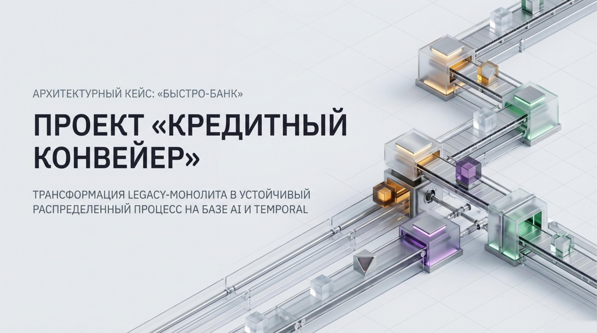
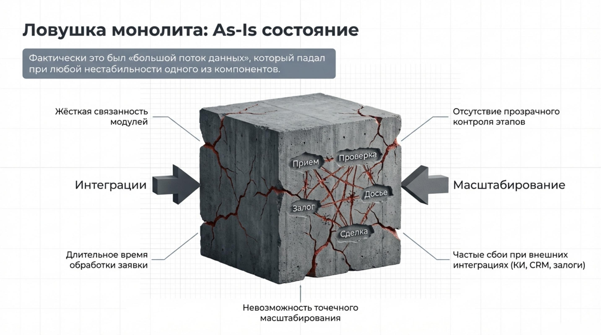
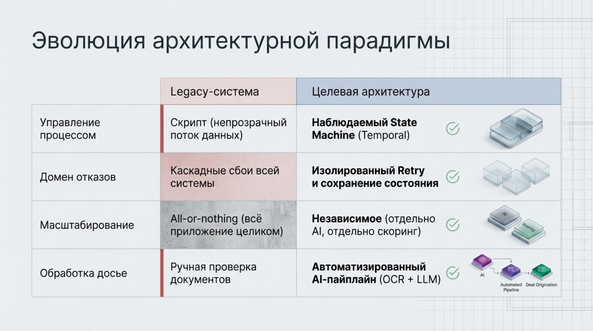
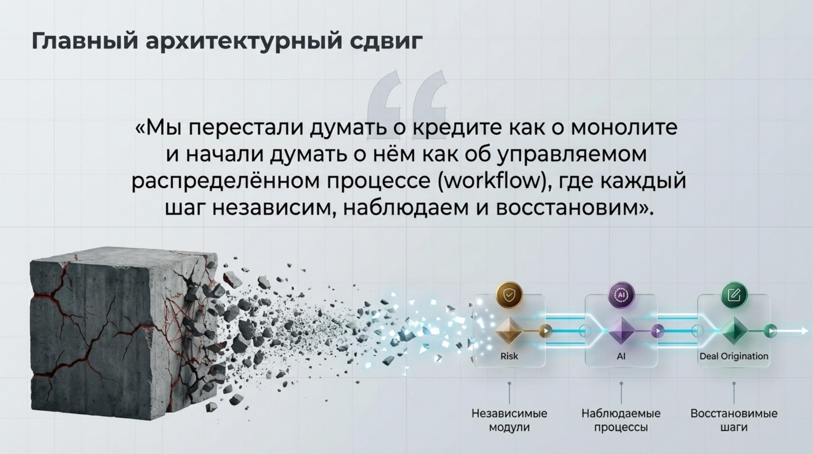
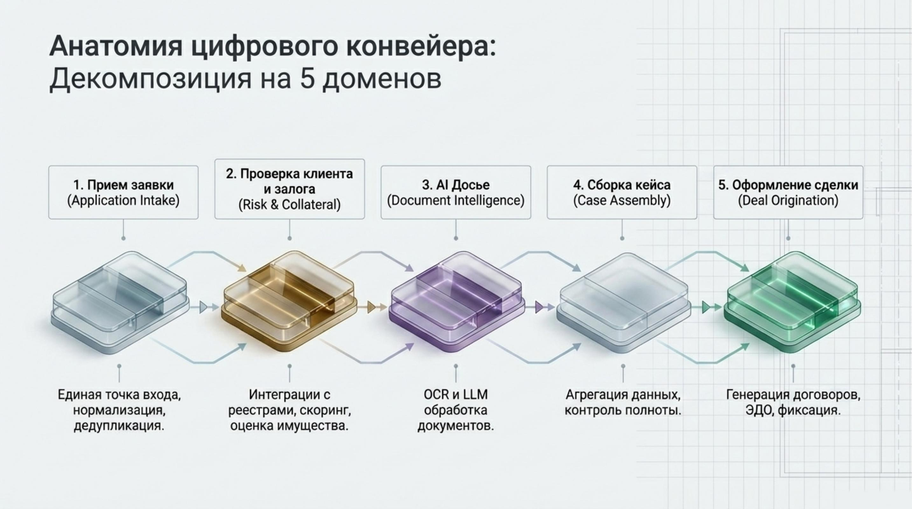
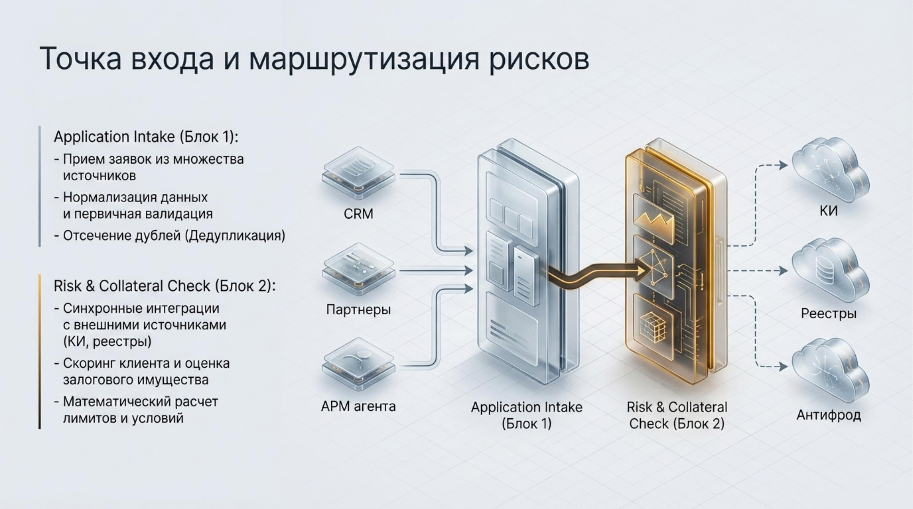
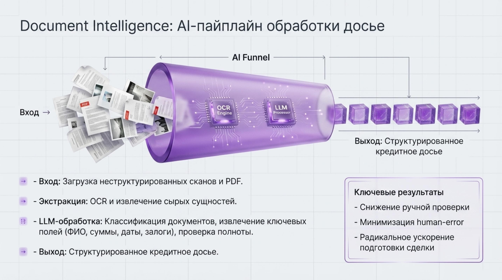
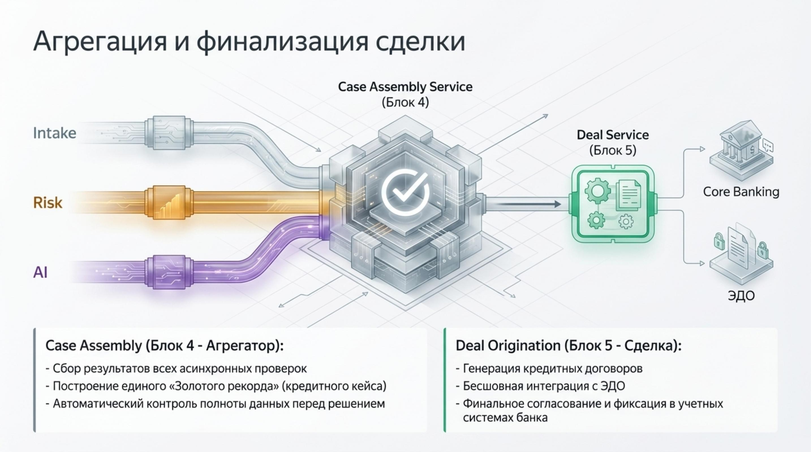
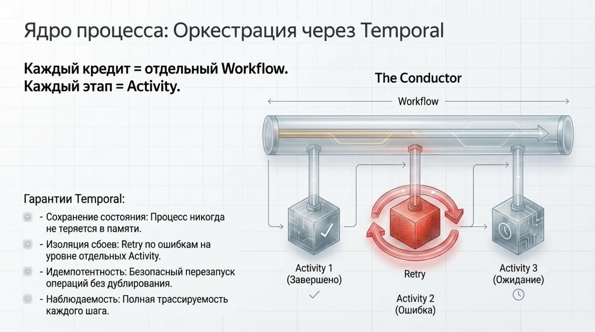
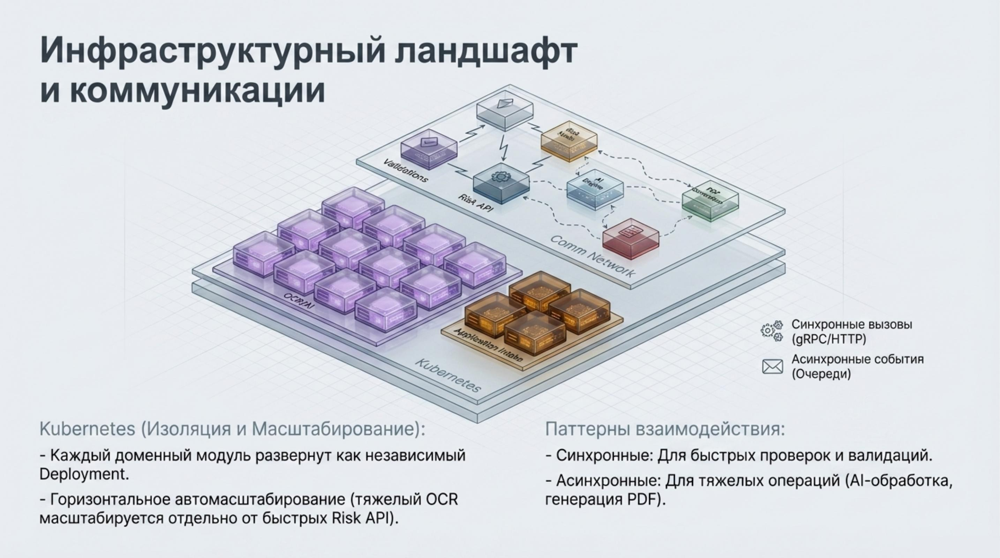
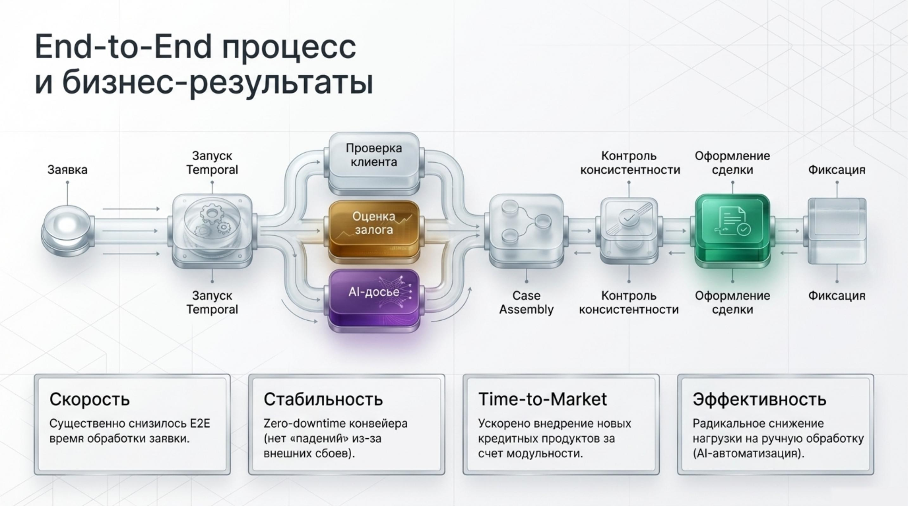

